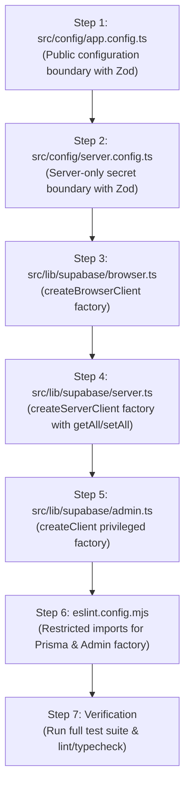

# Implementation Plan: Runtime Configuration and Supabase Client Boundary

## 1. Executive Summary & Objective

The objective of this work item is to establish a fail-closed configuration boundary and typed Supabase client factories in `jsf-pm-app` without querying or mutating application data.

Key boundary properties:
1. **Public Configuration Boundary (`src/config/app.config.ts`)**: Safe for browser and server use. Validates only `NEXT_PUBLIC_*` environment variables (`NEXT_PUBLIC_APP_URL`, `NEXT_PUBLIC_SUPABASE_URL`, `NEXT_PUBLIC_SUPABASE_PUBLISHABLE_KEY`). Implements presence-only check for `NEXT_PUBLIC_APP_URL` (resolving OQ-01) and strict HTTPS URL validation for `NEXT_PUBLIC_SUPABASE_URL`. Never imports or leaks server secrets.
2. **Server-Only Configuration Boundary (`src/config/server.config.ts`)**: Validates `SUPABASE_SECRET_KEY` synchronously at load time when imported for privileged operations. Fails closed safely without exposing secrets in error messages or serialized objects.
3. **Browser Supabase Client Factory (`src/lib/supabase/browser.ts`)**: Uses `createBrowserClient` from `@supabase/ssr` with public configuration under RLS. Does not import `next/headers` or server cookie stores.
4. **Server Supabase Client Factory (`src/lib/supabase/server.ts`)**: Uses `createServerClient` from `@supabase/ssr` with public configuration and non-deprecated `getAll`/`setAll` request cookie adapter under RLS.
5. **Privileged Supabase Client Factory (`src/lib/supabase/admin.ts`)**: Uses `createClient` from `@supabase/supabase-js` and `SUPABASE_SECRET_KEY`. Server-only, strictly factory-only (no queries or mutations executed), no `'use client'` directive.
6. **Structural Boundary & Guard Rules (`eslint.config.mjs`)**: Configures ESLint restricted-import rules rejecting runtime Prisma imports across application code and restricting privileged admin imports (`src/lib/supabase/admin`) from client components, shared modules, and middleware.

## 2. Delivery & Contract Constraints

- **Immutable Test Contracts**: The existing test suite in `__tests__/` serves as an immutable delivery contract. Tests will not be added, edited, deleted, skipped, weakened, or recreated.
- **Zero Real Credentials**: No real credentials or provider keys enter tracked artifacts, test fixtures, logs, or error responses.
- **Zero Application Schema / Data Mutation**: No migrations, table modifications, or database queries/mutations are executed.
- **Prisma Absence**: Complete absence of Prisma runtime imports, Prisma schema, or alternative ORMs.

---

## 3. Traceability Matrix & Coverage Mapping

| Requirement ID | Verification Criteria | Test Contract | Implementation Target | Expected Behavior |
|---|---|---|---|---|
| **REQ-CFG-001** | VC-CFG-001 | `__tests__/config/app.config.test.ts` | `src/config/app.config.ts` | Exports public configuration derived exclusively from `NEXT_PUBLIC_*` variables; no server-only imports. |
| **REQ-CFG-002** | VC-CFG-001 | `__tests__/config/app.config.test.ts` | `src/config/app.config.ts` | Requires non-empty `NEXT_PUBLIC_APP_URL` (presence only; does not reject non-URL format strings). |
| **REQ-CFG-003** | VC-CFG-001 | `__tests__/config/app.config.test.ts` | `src/config/app.config.ts` | Requires valid HTTPS `NEXT_PUBLIC_SUPABASE_URL` and non-empty `NEXT_PUBLIC_SUPABASE_PUBLISHABLE_KEY`; safe non-leaking errors. |
| **REQ-CFG-004** | VC-CFG-002 | `__tests__/config/server.config.test.ts` | `src/config/server.config.ts` | Validates `SUPABASE_SECRET_KEY` synchronously at load time; fails closed when absent/empty; never exported publicly. |
| **REQ-CFG-005** | VC-CFG-002 | `__tests__/config/server.config.test.ts` | `src/config/server.config.ts` | Redacts secrets from serialization/diagnostics; fails with safe non-leaking error messages. |
| **REQ-CFG-006** | VC-CFG-003 | `__tests__/config/credential-exposure.test.ts` | Tracked repository files & `.env.example` | Zero real credentials in tracked files; `.env.example` contains explicit placeholders (`replace_me`). |
| **REQ-SUP-001** | VC-SUP-001 | `__tests__/supabase/browser.test.ts` | `src/lib/supabase/browser.ts` | Client factory using `createBrowserClient` from `@supabase/ssr`; no `next/headers` or server cookie calls. |
| **REQ-SUP-002** | VC-SUP-002 | `__tests__/supabase/server.test.ts` | `src/lib/supabase/server.ts` | Request-context client factory using `createServerClient` from `@supabase/ssr` with `getAll`/`setAll` cookie adapter; no deprecated cookie methods. |
| **REQ-SUP-003** | VC-SUP-003 | `__tests__/supabase/admin.test.ts` | `src/lib/supabase/admin.ts` | Privileged client factory using `@supabase/supabase-js` and `SUPABASE_SECRET_KEY`; zero query/mutation calls. |
| **REQ-SUP-004** | VC-SUP-003 | `__tests__/supabase/admin.test.ts` | `eslint.config.mjs` & `src/lib/supabase/admin.ts` | Server-only boundary; restricted from client modules, shared code, middleware, and browser bundle. |
| **REQ-TST-001** | VC-TST-001 | Full test suite (`npm run test`) | All modules | All valid/invalid configurations, client factories, isolation boundaries, and safe error paths verified. |
| **REQ-TST-002** | VC-TST-002 | `__tests__/config/prisma-guard.test.ts` | `eslint.config.mjs` & `src/` | ESLint rule rejects `@prisma/client` or `prisma` imports in application code; zero Prisma imports in `src/`. |
| **REQ-TST-003** | VC-TST-002 | `__tests__/config/prisma-guard.test.ts` | Repository root | No `prisma/` directory or Prisma ORM dependencies. |

---

## 4. Implementation Steps & Bounded Changes



### Step 1: Implement Public Configuration Boundary (`src/config/app.config.ts`)
- **File**: `src/config/app.config.ts` [NEW]
- **Responsibilities**:
  - Define Zod schema validating:
    - `NEXT_PUBLIC_APP_URL`: non-empty string (`z.string().min(1, "NEXT_PUBLIC_APP_URL is required")`). Must not perform URL format parsing or validation (per REQ-CFG-002 / OQ-01).
    - `NEXT_PUBLIC_SUPABASE_URL`: HTTPS URL string (`z.string().min(1, "NEXT_PUBLIC_SUPABASE_URL is required").refine(val => val.startsWith("https://") && z.string().url().safeParse(val).success, { message: "NEXT_PUBLIC_SUPABASE_URL must be a valid HTTPS URL" })`).
    - `NEXT_PUBLIC_SUPABASE_PUBLISHABLE_KEY`: non-empty string (`z.string().min(1, "NEXT_PUBLIC_SUPABASE_PUBLISHABLE_KEY is required")`).
  - Execute schema validation safely against `process.env`.
  - On error, throw a safe, sanitized `Error` stating the missing/invalid variable name without dumping environment variables, stack traces, or secrets.
  - Export `appConfig` object with properties `{ appUrl, supabaseUrl, supabasePublishableKey }`.
  - Must not import or expose `SUPABASE_SECRET_KEY` or server-only modules.

### Step 2: Implement Server-Only Configuration Boundary (`src/config/server.config.ts`)
- **File**: `src/config/server.config.ts` [NEW]
- **Responsibilities**:
  - Validate `SUPABASE_SECRET_KEY` synchronously at load time using Zod: `z.string().min(1, "SUPABASE_SECRET_KEY is required")`.
  - Fail closed immediately upon module import if `SUPABASE_SECRET_KEY` is missing or empty.
  - Sanitize any error to ensure no secret values or stack dumps are leaked.
  - Export `serverConfig` or accessor function ensuring `JSON.stringify(serverConfig)` does not expose the secret value (e.g., custom `toJSON()` returning `[REDACTED]` or property getter pattern satisfying non-leakage).
  - Isolated from public `appConfig` and browser bundles.

### Step 3: Implement Browser Supabase Client Factory (`src/lib/supabase/browser.ts`)
- **File**: `src/lib/supabase/browser.ts` [NEW]
- **Responsibilities**:
  - Import `createBrowserClient` from `@supabase/ssr`.
  - Import `appConfig` from `@/config/app.config`.
  - Export `createClient()` factory function returning `createBrowserClient(appConfig.supabaseUrl, appConfig.supabasePublishableKey)`.
  - Strictly prohibit importing `next/headers` or invoking server cookie routines.

### Step 4: Implement Request-Context Server Supabase Client Factory (`src/lib/supabase/server.ts`)
- **File**: `src/lib/supabase/server.ts` [NEW]
- **Responsibilities**:
  - Import `createServerClient` from `@supabase/ssr`.
  - Import `appConfig` from `@/config/app.config`.
  - Export factory function `createClient(cookieStore: ...)` taking cookie store context, configuring the `cookies` adapter using modern non-deprecated `getAll` and `setAll` methods.
  - Avoid deprecated cookie methods (such as direct `cookies()` singleton calls within client instantiation without request context adapter).

### Step 5: Implement Privileged Supabase Client Factory (`src/lib/supabase/admin.ts`)
- **File**: `src/lib/supabase/admin.ts` [NEW]
- **Responsibilities**:
  - Import `createClient` from `@supabase/supabase-js`.
  - Import `appConfig` from `@/config/app.config`.
  - Import `serverConfig` / `SUPABASE_SECRET_KEY` validation from `@/config/server.config`.
  - Export `createAdminClient()` factory function returning `createClient(appConfig.supabaseUrl, serverConfig.supabaseSecretKey, { auth: { autoRefreshToken: false, persistSession: false } })`.
  - Contain no query or mutation operations (`.from()`, `.select()`, `.insert()`, etc.).
  - Contain no `'use client'` directive.

### Step 6: Configure ESLint Structural Import Guards (`eslint.config.mjs`)
- **File**: `eslint.config.mjs` [MODIFY]
- **Responsibilities**:
  - Add ESLint rule `no-restricted-imports` to reject:
    - `@prisma/client` and `prisma` in all application code (verifying REQ-TST-002 and REQ-TST-003).
    - `src/lib/supabase/admin` and `@/lib/supabase/admin` from client-side code, components, shared utilities, and middleware (verifying REQ-SUP-004).
  - Ensure string patterns `"@prisma/client"` and `"src/lib/supabase/admin"` exist within `eslint.config.mjs` to satisfy static tests in `__tests__/config/prisma-guard.test.ts` and `__tests__/supabase/admin.test.ts`.

### Step 7: Repository Verification & Test Suite Execution
- **Responsibilities**:
  - Run all immutable test contract files via `npm run test`.
  - Run static checks (`npm run lint`, `npm run typecheck`, `npm run format:check`).
  - Confirm all verification criteria pass with 0 errors and 0 warnings.

---

## 5. Affected Files

| File Path | Action | Description / Rationale |
|---|---|---|
| `src/config/app.config.ts` | **[NEW]** | Public runtime configuration module deriving only `NEXT_PUBLIC_*` values. |
| `src/config/server.config.ts` | **[NEW]** | Server-only configuration boundary validating `SUPABASE_SECRET_KEY` synchronously. |
| `src/lib/supabase/browser.ts` | **[NEW]** | Browser Supabase client factory using `@supabase/ssr` `createBrowserClient`. |
| `src/lib/supabase/server.ts` | **[NEW]** | Request-context Server Supabase client factory using `@supabase/ssr` `createServerClient`. |
| `src/lib/supabase/admin.ts` | **[NEW]** | Privileged Supabase client factory using `@supabase/supabase-js` `createClient`. |
| `eslint.config.mjs` | **[MODIFY]** | Configure structural import restrictions for Prisma and the admin client factory. |

---

## 6. Verification Commands & Acceptance Criteria

### Automated Test Verification
Run each test contract individually and as a unified suite:
```bash
npm run test -- __tests__/config/app.config.test.ts
npm run test -- __tests__/config/server.config.test.ts
npm run test -- __tests__/config/credential-exposure.test.ts
npm run test -- __tests__/config/prisma-guard.test.ts
npm run test -- __tests__/supabase/browser.test.ts
npm run test -- __tests__/supabase/server.test.ts
npm run test -- __tests__/supabase/admin.test.ts
npm run test
```

### Static Analysis, Typecheck & Formatting Verification
```bash
npm run lint
npm run typecheck
npm run format:check
```

---

## 7. Explicit Non-Goals & Scope Exclusions

1. **Database Schema & Migrations**: No database tables, schemas, migrations under `supabase/migrations/`, RLS policies, RPCs, or generated types in `src/lib/database.types.ts` will be modified or added.
2. **Data Mutations / Queries**: No data queries, mutations, auth session calls, or remote API calls are performed in factory modules.
3. **Application Auth Flows**: No user sign-in/up UI, session management middleware, or route handlers are implemented in this work item.
4. **Third-Party Integrations**: No Sentry, Stripe, Resend, Upstash, or external telemetry integrations are configured in this work item.
5. **Prisma / Parallel ORMs**: No Prisma schema, migration tools, or alternative ORMs will be introduced.

---

## 8. Assumptions & Dependencies

1. **Test Seam Readiness**: The testing harness (`vitest`) configured in package scripts executes all tests in `__tests__/` in an isolated Node environment.
2. **Dependency Versions**: Dependencies `@supabase/ssr` (v0.12.4), `@supabase/supabase-js` (v2.112.2), `zod` (v3.25.76), and `next` (v16.3.0) are already installed in `node_modules`.
3. **Branch**: Changes target feature branch `feature/s01-e01-02-runtime-config-and-supabase-client-boundary`.

---

## 9. Risks & Stop Conditions

| Risk / Event | Impact | Mitigation / Stop Condition |
|---|---|---|
| Discovery of schema or RLS requirements | High | **Stop Condition**: Halt implementation immediately; route request as a separate schema work item per VSDD guidelines. |
| Test contract failure due to immutable constraints | High | **Stop Condition**: Do not alter test files. Refactor implementation code until strict contract compatibility is achieved. |
| Accidental secret exposure in build output or public bundle | Critical | **Stop Condition**: Ensure `src/config/server.config.ts` and `src/lib/supabase/admin.ts` are never imported by client modules and are blocked by ESLint boundary rules. |
| Incompatible `@supabase/ssr` cookie contract | Medium | Use strictly non-deprecated `getAll` and `setAll` methods in request-context server factory. |
