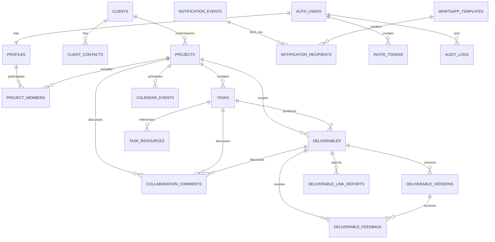

# Joya Star Films PM App — Database Schema

> Enterprise-Grade PostgreSQL / Supabase Data Architecture

---

## Table of Contents

1. [Document Purpose and Authority](#1-document-purpose-and-authority)
2. [v1.7 Reconciliation Record](#11-v17-reconciliation-record)
3. [Architecture Summary](#2-architecture-summary)
4. [Schema Design Principles](#3-schema-design-principles)
5. [Naming, Types, and Conventions](#4-naming-types-and-conventions)
6. [Extensions and Database Schemas](#5-extensions-and-database-schemas)
7. [Enumerated Types](#6-enumerated-types)
8. [Entity Relationship Model](#7-entity-relationship-model)
9. [Table Specifications](#8-table-specifications)
10. [Constraints and Invariants](#9-constraints-and-invariants)
11. [Row-Level Security Architecture](#10-row-level-security-architecture)
12. [Database Functions](#11-database-functions)
13. [Triggers and Transactional Automation](#12-triggers-and-transactional-automation)
14. [Views and Reporting Interfaces](#13-views-and-reporting-interfaces)
15. [Indexes and Query Performance](#14-indexes-and-query-performance)
16. [Realtime Publication Strategy](#15-realtime-publication-strategy)
17. [Notification Idempotency and Workflow Safety](#16-notification-idempotency-and-workflow-safety)
18. [Data Retention, Archival, and Recovery](#17-data-retention-archival-and-recovery)
19. [Migration and Deployment Order](#18-migration-and-deployment-order)
20. [Seed Data](#19-seed-data)
21. [Database Testing Requirements](#20-database-testing-requirements)
22. [Operational Guardrails](#21-operational-guardrails)
23. [Resolved Schema Decisions](#22-resolved-schema-decisions)
24. [Resolved Re-Review Confirmation](#23-resolved-re-review-confirmation)
25. [Appendix A - Canonical DDL Blueprint](#24-appendix-a---canonical-ddl-blueprint)
26. [Appendix B - RLS Policy Matrix](#25-appendix-b---rls-policy-matrix)
27. [Appendix C - Critical Query Patterns](#26-appendix-c---critical-query-patterns)

---

## 1. Document Purpose and Authority

This document is the authoritative database design specification for the Joya Star Films PM App. It translates the Product Requirements Document (PRD), Software Architecture Document (SAD), and accepted Architecture Decision Records (ADRs) into an implementable PostgreSQL schema for Supabase.

Where database details in the PRD conflict with later architectural decisions, this document follows the precedence order below:

1. Accepted ADRs
2. This database schema specification
3. SAD
4. PRD

The schema is designed for:

- Supabase PostgreSQL and Supabase Auth
- Runtime access through `@supabase/ssr` and the Supabase JavaScript client
- Repository-tracked append-only Supabase SQL migrations only; Prisma is fully prohibited
- Strict Row-Level Security (RLS)
- A small launch workload of approximately 20-25 users and 4-5 concurrent active projects
- Free-tier-conscious operation without security shortcuts
- External URL-only file handoff: production submissions use Google Drive; client submissions may use validated public HTTPS providers; no file content is stored or fetched

This document defines logical structure, constraints, RLS policy intent, indexing, lifecycle automation, idempotency, and migration sequencing. Application code remains responsible for orchestration, input validation, user-facing localization, and external API calls.

### 1.1 v1.7 Reconciliation Record

This reconciled stable draft retains the complete v1.6 data model, lifecycle rules, RLS intent, projection model, table inventory, indexes, notification model, retention posture, and DDL blueprint. It supersedes only the earlier wording whose architecture was changed by later accepted decisions.

- Prisma is completely prohibited. Any v1.6 wording that allowed it for migration management is historical and must not be implemented.
- `supabase/migrations/` is the sole append-only, versioned source for schema and database-policy change. No parallel ORM or schema-migration system is permitted.
- Runtime browser and server access uses `@supabase/ssr` under RLS. `profiles.role` is the sole application-role authority; mutable Auth metadata and caller-supplied role or actor fields are never authorization inputs.
- `src/lib/database.types.ts` is a derived schema artifact and is never manually authored, modified, or repaired.
- The current implementation target is `jsf-pm-dev`; the complete model remains a durable product authority rather than a temporary sprint-only schema.

This document does not prescribe UI, route handlers, provider activation, workflow orchestration, or database-operation tooling. Those concerns remain in their own repository artifacts and accepted decisions.

---

## 2. Architecture Summary

### 2.1 Data Ownership Boundaries

| Boundary                                        | System of Record                                                                              |
| ----------------------------------------------- | --------------------------------------------------------------------------------------------- |
| Authentication identities and sessions          | Supabase Auth (`auth.users`, Auth-managed tables)                                             |
| Application user profile and authorization role | `public.profiles`                                                                             |
| Client organizations and contacts               | `public.clients`, `public.client_contacts`                                                    |
| Projects and project membership                 | `public.projects`, `public.project_members`                                                   |
| Work planning and execution                     | `public.tasks`, `public.task_resources`, `public.deliverables`, `public.deliverable_versions` |
| Review comments and decisions                   | `public.deliverable_feedback`                                                                 |
| Milestones and manual calendar events           | `public.calendar_events`                                                                      |
| In-app and outbound notifications               | `public.notification_events`, `public.notification_recipients`                                |
| WhatsApp template metadata                      | `public.whatsapp_templates`                                                                   |
| Invite replay prevention                        | `public.invite_tokens`                                                                        |
| Immutable state and security history            | `public.audit_logs`                                                                           |
| Broken/inaccessible external link reports       | `public.deliverable_link_reports`                                                             |
| Internal project/task/deliverable collaboration | `public.collaboration_comments`                                                               |

### 2.2 Trust Model

- `auth.users` proves identity.
- `profiles.role` supplies the application role. Authorization data must not be trusted from user-editable `raw_user_meta_data`.
- RLS is the final authorization boundary for all tables exposed through the Supabase Data API.
- Privileged service-role operations are limited to trusted server routes, workflows, webhooks, and administration functions.
- State transitions are validated in the database in addition to application-level state-machine validation.
- Audit and notification event records are immutable.

### 2.3 Cost-Control Strategy

The design avoids infrastructure-heavy patterns:

- No binary deliverable storage in Supabase Storage
- No database polling loops faster than the accepted Upstash schedules
- No per-metric materialized tables at launch
- No unbounded event payloads
- No broad Realtime publication of operational tables
- Partial indexes limit active-row query costs
- Audit-derived telemetry avoids timer services and write amplification
- Notification deduplication prevents duplicate WhatsApp spend

---

## 3. Schema Design Principles

### 3.1 UUID Primary Keys

Application-owned tables use `UUID` primary keys generated with `gen_random_uuid()`. Foreign keys to Supabase Auth use `UUID REFERENCES auth.users(id)`.

### 3.2 UTC Timestamps

All timestamps use `TIMESTAMPTZ` and are stored in UTC. Localization to `America/Mexico_City` or user locale occurs at the application boundary.

### 3.3 Soft Deletion

Mutable business entities use `deleted_at TIMESTAMPTZ NULL`. User-facing RLS policies and standard queries exclude deleted rows.

Soft deletion does **not** apply to immutable or security-history tables where deletion would undermine traceability:

- `audit_logs`
- `notification_events`
- `deliverable_versions`
- `deliverable_feedback`
- `notification_recipients`
- `invite_tokens`
- `deliverable_link_reports`

`audit_logs`, `notification_events`, `deliverable_versions`, and `deliverable_feedback` are append-only. `notification_recipients`, `invite_tokens`, and `deliverable_link_reports` permit only constrained lifecycle/status updates through trusted functions. All use explicit retention rules rather than row-level soft deletion.

### 3.4 Append-Only Auditability

`audit_logs` is append-only. Authenticated users receive no direct `INSERT`, `UPDATE`, or `DELETE` privileges. Rows are written by controlled database functions or trusted server-side service-role code.

### 3.5 Minimal PII

Store only information required for application operation and legal consent tracking. Do not copy authentication secrets, password hashes, refresh tokens, or full WhatsApp webhook bodies into public application tables.

### 3.6 Explicit State Machines

Task and deliverable state transitions are constrained by database functions. Direct arbitrary status updates are prohibited for normal users.

### 3.7 Referential Integrity First

Foreign keys are mandatory for owned relationships. Polymorphic references are limited to event and audit records where a conventional foreign key cannot represent multiple entity types.

### 3.8 RLS-Friendly Denormalization

`tasks.project_id` and `deliverables.project_id` are stored directly even though they can be derived through parent relationships. This is deliberate:

- Simplifies and accelerates RLS checks
- Reduces policy joins
- Makes project-scoped filtering explicit
- Supports efficient notification and archive queries

Triggers guarantee consistency between the denormalized project IDs and parent rows.

---

## 4. Naming, Types, and Conventions

| Item                       | Convention                                                       |
| -------------------------- | ---------------------------------------------------------------- |
| Schemas, tables, columns   | `snake_case`                                                     |
| Primary key                | `id UUID`                                                        |
| Foreign key                | `<entity>_id`                                                    |
| Boolean                    | `is_*`, `has_*`, or explicit consent/action wording              |
| Created/updated timestamps | `created_at`, `updated_at`                                       |
| Soft deletion              | `deleted_at`                                                     |
| Status values              | PostgreSQL enums in English                                      |
| Monetary values            | Not currently required; use integer minor units if introduced    |
| URLs                       | `TEXT` with database length/check constraints and Zod validation |
| Free-form metadata         | Bounded `JSONB`, never used as a substitute for core columns     |
| User-facing text           | `TEXT`; length constraints applied where operationally important |

### 4.1 Standard Mutable Entity Columns

Most mutable business tables include:

```sql
id          uuid        primary key default gen_random_uuid(),
created_at  timestamptz not null default now(),
updated_at  timestamptz not null default now(),
deleted_at  timestamptz null
```

### 4.2 Actor Columns

Where meaningful, mutable entities include:

```sql
created_by uuid null references auth.users(id) on delete set null,
updated_by uuid null references auth.users(id) on delete set null
```

`created_by` may be null only for migration, system, or webhook-created records.

---

## 5. Extensions and Database Schemas

### 5.1 Required Extensions

```sql
create extension if not exists pgcrypto;
create extension if not exists citext;
```

- `pgcrypto` provides `gen_random_uuid()` and cryptographic helpers.
- `citext` provides case-insensitive email handling for CRM and invitation records.

### 5.2 Database Schemas

| Schema    | Exposure          | Purpose                                                                   |
| --------- | ----------------- | ------------------------------------------------------------------------- |
| `public`  | Supabase Data API | Application tables and security-invoker views                             |
| `private` | Not exposed       | RLS helper functions, transition functions, internal maintenance routines |
| `auth`    | Supabase-managed  | Authentication identities and sessions                                    |

All `SECURITY DEFINER` functions must be created in `private`, use a fixed `search_path`, revoke execution from `public`, and grant execution only to the minimum required roles.

---

## 6. Enumerated Types

```sql
create type public.app_role as enum ('admin', 'pm', 'operator', 'client');

create type public.project_type as enum ('client', 'internal');
create type public.project_status as enum (
  'planning', 'in_progress', 'paused', 'completed', 'cancelled'
);

create type public.project_member_type as enum (
  'pm_lead', 'pm_watcher', 'operator', 'client'
);

create type public.collaboration_target_type as enum (
  'project', 'task', 'deliverable'
);

create type public.collaboration_author_capacity as enum (
  'admin', 'pm_lead', 'pm_watcher', 'operator'
);

create type public.task_status as enum (
  'pending', 'in_progress', 'in_review', 'completed', 'blocked'
);

create type public.task_type as enum ('internal_work', 'client_request');
create type public.task_priority as enum ('low', 'medium', 'high', 'blocking');

create type public.deliverable_workflow_type as enum (
  'production', 'client_submission'
);

create type public.deliverable_status as enum (
  'pending',
  'awaiting_internal_review',
  'awaiting_client_review',
  'approved',
  'changes_requested',
  'delivered',
  'submitted'
);

create type public.submission_provider as enum (
  'google_drive', 'dropbox', 'onedrive', 'wetransfer', 'frame_io', 'other_https'
);

create type public.review_stage as enum ('internal', 'client');
create type public.review_decision as enum ('approved', 'changes_requested');

create type public.notification_channel as enum ('in_app', 'whatsapp', 'email');
create type public.notification_delivery_status as enum (
  'pending', 'processing', 'sent', 'delivered', 'read', 'failed', 'cancelled'
);

create type public.notification_trigger as enum (
  'user_invited',
  'project_assigned',
  'task_assigned',
  'task_status_changed',
  'client_task_blocking',
  'client_submission_received',
  'client_submission_reopened',
  'deliverable_submitted',
  'internal_changes_requested',
  'internal_review_approved',
  'client_changes_requested',
  'client_review_approved',
  'deliverable_delivered',
  'deadline_24h',
  'deadline_12h',
  'deadline_6h',
  'deadline_overdue',
  'review_inactivity_reminder',
  'link_reported_broken',
  'invite_expiring',
  'system'
);

create type public.entity_type as enum (
  'profile', 'client', 'project', 'project_member', 'task', 'deliverable',
  'deliverable_version', 'feedback', 'calendar_event', 'notification',
  'invite_token', 'collaboration_comment', 'link_report'
);

create type public.invite_status as enum ('pending', 'accepted', 'expired', 'revoked');
create type public.whatsapp_template_status as enum (
  'draft', 'pending_approval', 'approved', 'paused', 'rejected', 'disabled'
);
create type public.link_report_status as enum ('open', 'resolved', 'dismissed');
create type public.calendar_event_type as enum (
  'project_deadline', 'task_deadline', 'internal_review_deadline',
  'client_delivery_deadline', 'milestone'
);
```

### 6.1 Enum Evolution Rule

PostgreSQL enum values are additive. Renaming or removing a value requires a deliberate migration. Do not encode temporary UI states as enums.

---

## 7. Entity Relationship Model



---

## 8. Table Specifications

## 8.1 `profiles`

Application profile and authorization record linked one-to-one with `auth.users`.

| Column                        | Type          | Null | Default                 | Rules                                           |
| ----------------------------- | ------------- | :--: | ----------------------- | ----------------------------------------------- |
| `id`                          | `UUID`        |  No  | -                       | PK; FK to `auth.users(id)`; no cascade deletion |
| `role`                        | `app_role`    |  No  | -                       | Set only by trusted onboarding/admin process    |
| `full_name`                   | `TEXT`        |  No  | -                       | 1-120 characters                                |
| `phone_e164`                  | `TEXT`        | Yes  | -                       | E.164 format; unique when present               |
| `preferred_locale`            | `TEXT`        |  No  | `'es-MX'`               | Allowed: `es-MX`, `en-US`                       |
| `timezone`                    | `TEXT`        |  No  | `'America/Mexico_City'` | IANA timezone                                   |
| `avatar_url`                  | `TEXT`        | Yes  | -                       | HTTPS URL only                                  |
| `whatsapp_opt_in`             | `BOOLEAN`     |  No  | `false`                 | Current consent state                           |
| `whatsapp_consent_at`         | `TIMESTAMPTZ` | Yes  | -                       | Required when opted in                          |
| `whatsapp_consent_ip`         | `INET`        | Yes  | -                       | Required when opted in                          |
| `whatsapp_consent_source`     | `TEXT`        | Yes  | -                       | E.g. `onboarding`, `settings`                   |
| `email_notifications_enabled` | `BOOLEAN`     |  No  | `true`                  | Fallback preference                             |
| `is_active`                   | `BOOLEAN`     |  No  | `true`                  | Application access status                       |
| `last_seen_at`                | `TIMESTAMPTZ` | Yes  | -                       | Throttled updates only                          |
| `created_at`                  | `TIMESTAMPTZ` |  No  | `now()`                 |                                                 |
| `updated_at`                  | `TIMESTAMPTZ` |  No  | `now()`                 |                                                 |
| `deleted_at`                  | `TIMESTAMPTZ` | Yes  | -                       | Account deactivation marker                     |

### Constraints

- Consent fields must be populated when `whatsapp_opt_in = true`.
- Clients may update their own contact, locale, and consent fields, but never `role`, `is_active`, or `deleted_at`.
- Role changes require an audited admin function.

## 8.2 `clients`

CRM entity representing an organization or commercial client. A client may outlive any individual user account or project.

| Column                     | Type          | Null | Default             | Rules                               |
| -------------------------- | ------------- | :--: | ------------------- | ----------------------------------- |
| `id`                       | `UUID`        |  No  | `gen_random_uuid()` | PK                                  |
| `legal_name`               | `TEXT`        |  No  | -                   | 1-160 characters                    |
| `display_name`             | `TEXT`        |  No  | -                   | 1-120 characters                    |
| `slug`                     | `TEXT`        |  No  | -                   | Unique among non-deleted rows       |
| `notes`                    | `TEXT`        | Yes  | -                   | PM/Admin only; max 5,000 characters |
| `default_drive_folder_url` | `TEXT`        | Yes  | -                   | Valid Google Drive URL              |
| `is_active`                | `BOOLEAN`     |  No  | `true`              |                                     |
| `created_by`               | `UUID`        | Yes  | -                   | FK `auth.users`; PM/Admin           |
| `updated_by`               | `UUID`        | Yes  | -                   | FK `auth.users`                     |
| `created_at`               | `TIMESTAMPTZ` |  No  | `now()`             |                                     |
| `updated_at`               | `TIMESTAMPTZ` |  No  | `now()`             |                                     |
| `deleted_at`               | `TIMESTAMPTZ` | Yes  | -                   |                                     |

## 8.3 `client_contacts`

Associates one or more contacts with a client organization and optionally links a contact to an authenticated client user.

| Column       | Type          | Null | Default             | Rules                                  |
| ------------ | ------------- | :--: | ------------------- | -------------------------------------- |
| `id`         | `UUID`        |  No  | `gen_random_uuid()` | PK                                     |
| `client_id`  | `UUID`        |  No  | -                   | FK `clients(id)`                       |
| `profile_id` | `UUID`        | Yes  | -                   | FK `profiles(id)`; unique when present |
| `full_name`  | `TEXT`        |  No  | -                   | 1-120 characters                       |
| `email`      | `CITEXT`      |  No  | -                   | Valid email                            |
| `phone_e164` | `TEXT`        | Yes  | -                   | E.164                                  |
| `job_title`  | `TEXT`        | Yes  | -                   | Max 120                                |
| `is_primary` | `BOOLEAN`     |  No  | `false`             | One active primary contact per client  |
| `created_by` | `UUID`        | Yes  | -                   | FK `auth.users`                        |
| `updated_by` | `UUID`        | Yes  | -                   | FK `auth.users`                        |
| `created_at` | `TIMESTAMPTZ` |  No  | `now()`             |                                        |
| `updated_at` | `TIMESTAMPTZ` |  No  | `now()`             |                                        |
| `deleted_at` | `TIMESTAMPTZ` | Yes  | -                   |                                        |

## 8.4 `projects`

Top-level work container.

| Column                 | Type             |    Null     | Default             | Rules                                                                      |
| ---------------------- | ---------------- | :---------: | ------------------- | -------------------------------------------------------------------------- |
| `id`                   | `UUID`           |     No      | `gen_random_uuid()` | PK                                                                         |
| `client_id`            | `UUID`           | Conditional | -                   | Required for `client`; null for `internal`                                 |
| `project_type`         | `project_type`   |     No      | `'client'`          |                                                                            |
| `status`               | `project_status` |     No      | `'planning'`        |                                                                            |
| `name`                 | `TEXT`           |     No      | -                   | 1-160 characters                                                           |
| `internal_description` | `TEXT`           |     No      | -                   | PM/operator internal; hidden from clients                                  |
| `client_scope`         | `TEXT`           |     Yes     | -                   | Client-safe scope/summary                                                  |
| `deadline_at`          | `TIMESTAMPTZ`    |     No      | -                   | Must be after creation                                                     |
| `drive_folder_url`     | `TEXT`           |     Yes     | -                   | Valid Google Drive folder URL                                              |
| `completed_at`         | `TIMESTAMPTZ`    |     Yes     | -                   | Current completion endpoint; set on completion and cleared on reopening    |
| `archived_at`          | `TIMESTAMPTZ`    |     Yes     | -                   | Operational archive, not deletion                                          |
| `created_by`           | `UUID`           |     No      | -                   | FK `auth.users`; PM/Admin                                                  |
| `updated_by`           | `UUID`           |     Yes     | -                   | FK `auth.users`                                                            |
| `created_at`           | `TIMESTAMPTZ`    |     No      | `now()`             |                                                                            |
| `updated_at`           | `TIMESTAMPTZ`    |     No      | `now()`             |                                                                            |
| `deleted_at`           | `TIMESTAMPTZ`    |     Yes     | -                   | Administrative soft deletion only; distinct from cancellation and archival |

**Important:** PM Leads and Watchers are represented in `project_members`; they are not duplicate columns on `projects`. Multiple active Leads and Watchers are supported.

## 8.5 `project_members`

Canonical project assignment and visibility table.

| Column                   | Type                  | Null | Default             | Rules                          |
| ------------------------ | --------------------- | :--: | ------------------- | ------------------------------ |
| `id`                     | `UUID`                |  No  | `gen_random_uuid()` | PK                             |
| `project_id`             | `UUID`                |  No  | -                   | FK `projects(id)`              |
| `user_id`                | `UUID`                |  No  | -                   | FK `profiles(id)`              |
| `member_type`            | `project_member_type` |  No  | -                   | Assignment capacity            |
| `is_primary`             | `BOOLEAN`             |  No  | `false`             | Valid only for `pm_lead`; exactly one active primary Lead per project for accountability/default assignment/escalation |
| `receives_notifications` | `BOOLEAN`             |  No  | `true`              |                                |
| `joined_at`              | `TIMESTAMPTZ`         |  No  | `now()`             |                                |
| `created_by`             | `UUID`                |  No  | -                   | PM/Admin                       |
| `created_at`             | `TIMESTAMPTZ`         |  No  | `now()`             |                                |
| `updated_at`             | `TIMESTAMPTZ`         |  No  | `now()`             |                                |
| `deleted_at`             | `TIMESTAMPTZ`         | Yes  | -                   | Membership removal             |

### Constraints

- One active membership per `(project_id, user_id, member_type)` capacity. The same user may hold multiple compatible capacities when business rules permit; no two active rows may duplicate the same capacity.
- Every active project has one or more active `pm_lead` memberships.
- Exactly one active `pm_lead` per project has `is_primary = true`; there is no maximum number of Leads.
- A project may have zero or more active `pm_watcher` memberships; there is no one-Watcher limit.
- Every active client project has one or more active `client` memberships; there is no arbitrary maximum. Internal projects have none.
- `is_primary = true` is invalid for non-Lead memberships.
- `member_type` must be compatible with `profiles.role`:
  - `pm_lead`, `pm_watcher` -> `pm`
  - `operator` -> `operator`
  - `client` -> `client`
- Internal projects cannot have client members.

## 8.6 `tasks`

Project task assigned to one active project member. Client assignment is permitted only for typed client requests.

| Column             | Type            | Null | Default             | Rules                                         |
| ------------------ | --------------- | :--: | ------------------- | --------------------------------------------- |
| `id`               | `UUID`          |  No  | `gen_random_uuid()` | PK                                            |
| `project_id`       | `UUID`          |  No  | -                   | FK `projects(id)`                             |
| `assignee_id`      | `UUID`          |  No  | -                   | FK `profiles(id)`; workflow-compatible active project member |
| `task_type`        | `task_type`      |  No  | `'internal_work'`   | `client_request` only for direct Client assignments |
| `title`            | `TEXT`          |  No  | -                   | 1-180 characters                              |
| `description`      | `TEXT`          |  No  | -                   | Max 20,000 characters                         |
| `status`           | `task_status`   |  No  | `'pending'`         |                                               |
| `priority`         | `task_priority` |  No  | `'medium'`          |                                               |
| `has_deliverables` | `BOOLEAN`       |  No  | `false`             |                                               |
| `deadline_at`      | `TIMESTAMPTZ`   |  No  | -                   |                                               |
| `started_at`       | `TIMESTAMPTZ`   | Yes  | -                   | Derived convenience timestamp                 |
| `completed_at`     | `TIMESTAMPTZ`   | Yes  | -                   | Set on completion                             |
| `created_by`       | `UUID`          |  No  | -                   | PM/Admin                                      |
| `updated_by`       | `UUID`          | Yes  | -                   |                                               |
| `created_at`       | `TIMESTAMPTZ`   |  No  | `now()`             |                                               |
| `updated_at`       | `TIMESTAMPTZ`   |  No  | `now()`             |                                               |
| `deleted_at`       | `TIMESTAMPTZ`   | Yes  | -                   |                                               |

### Constraints

- `assignee_id` must reference an active member of the same project.
- `task_type = 'client_request'` requires a client project and an assignee with active `project_members.member_type = 'client'`.
- Client assignees may transition only their own request from `pending → in_progress`, `pending → completed`, or `in_progress → completed`; only a PM Lead/Admin may set `blocked`, reassign, edit planning fields, or reopen completion.
- `priority = 'blocking'` means dependent project work cannot proceed; it is distinct from `status = 'blocked'`.
- A `client_request` cannot enter `in_review` and cannot complete while an active child `client_submission` is not `submitted`.

## 8.7 `task_resources`

Named external links attached to a task.

| Column       | Type          | Null | Default             | Rules                |
| ------------ | ------------- | :--: | ------------------- | -------------------- |
| `id`         | `UUID`        |  No  | `gen_random_uuid()` | PK                   |
| `task_id`    | `UUID`        |  No  | -                   | FK `tasks(id)`       |
| `name`       | `TEXT`        |  No  | -                   | 1-120 characters     |
| `url`        | `TEXT`        |  No  | -                   | HTTPS URL; max 2,048 |
| `sort_order` | `SMALLINT`    |  No  | `0`                 | Non-negative         |
| `created_by` | `UUID`        |  No  | -                   |                      |
| `created_at` | `TIMESTAMPTZ` |  No  | `now()`             |                      |
| `updated_at` | `TIMESTAMPTZ` |  No  | `now()`             |                      |
| `deleted_at` | `TIMESTAMPTZ` | Yes  | -                   |                      |

## 8.8 `deliverables`

Logical deliverable and current lifecycle state. Version-specific external URLs are stored in `deliverable_versions`.

| Column                        | Type                 | Null | Default             | Rules                          |
| ----------------------------- | -------------------- | :--: | ------------------- | ------------------------------ |
| `id`                          | `UUID`               |  No  | `gen_random_uuid()` | PK                             |
| `project_id`                  | `UUID`               |  No  | -                   | Denormalized FK `projects(id)` |
| `task_id`                     | `UUID`               |  No  | -                   | FK `tasks(id)`                 |
| `assignee_id`                 | `UUID`               |  No  | -                   | Workflow-compatible active project member |
| `workflow_type`               | `deliverable_workflow_type` | No | `'production'` | Production output or client-supplied input |
| `title`                       | `TEXT`               |  No  | -                   | 1-180 characters               |
| `specifications`              | `TEXT`               |  No  | -                   | Max 30,000 characters          |
| `status`                      | `deliverable_status` |  No  | `'pending'`         |                                |
| `current_version_number`      | `INTEGER`            |  No  | `0`                 | Managed transactionally        |
| `internal_review_deadline_at` | `TIMESTAMPTZ`        | Conditional | -             | Required for `production`; null for `client_submission` |
| `client_delivery_deadline_at` | `TIMESTAMPTZ`        | Conditional | -             | Required for `production`; must be >= internal deadline |
| `submission_deadline_at`      | `TIMESTAMPTZ`        | Conditional | -             | Required for `client_submission`; null for `production` |
| `last_activity_at`            | `TIMESTAMPTZ`        |  No  | `now()`             | Used by stall detection        |
| `is_stalled`                  | `BOOLEAN`            |  No  | `false`             | Scheduler-managed cache        |
| `stalled_at`                  | `TIMESTAMPTZ`        | Yes  | -                   |                                |
| `approved_at`                 | `TIMESTAMPTZ`        | Yes  | -                   | Client approval timestamp      |
| `delivered_at`                | `TIMESTAMPTZ`        | Yes  | -                   | Final handoff timestamp        |
| `created_by`                  | `UUID`               |  No  | -                   | PM/Admin                       |
| `updated_by`                  | `UUID`               | Yes  | -                   |                                |
| `created_at`                  | `TIMESTAMPTZ`        |  No  | `now()`             |                                |
| `updated_at`                  | `TIMESTAMPTZ`        |  No  | `now()`             |                                |
| `deleted_at`                  | `TIMESTAMPTZ`        | Yes  | -                   |                                |

**Why no `internal_comments` or `client_comments` columns:** Review comments are immutable review records in `deliverable_feedback`, preserving multiple review cycles and actor attribution.

### Workflow Invariants

- `production` requires an active PM/Operator assignee, both review/delivery deadlines, and a status other than `submitted`.
- `client_submission` requires an active Client assignee on the same client project, one submission deadline, null review deadlines, and status in (`pending`, `submitted`) only.
- `client_submission` cannot create `deliverable_feedback` or review-inactivity events. `submitted → pending` is available only to a PM Lead/Admin through an audited reopen with a required reason.

## 8.9 `deliverable_versions`

Immutable URL submission versions for either workflow.

| Column            | Type          | Null | Default             | Rules                                 |
| ----------------- | ------------- | :--: | ------------------- | ------------------------------------- |
| `id`              | `UUID`        |  No  | `gen_random_uuid()` | PK                                    |
| `deliverable_id`  | `UUID`        |  No  | -                   | FK `deliverables(id)`                 |
| `version_number`  | `INTEGER`     |  No  | -                   | Starts at 1; unique per deliverable   |
| `submission_url`  | `TEXT`        |  No  | -                   | Validated public HTTPS URL; max 2,048 |
| `submission_provider` | `submission_provider` | No | -             | Derived server-side from normalized hostname |
| `submitted_by`    | `UUID`        |  No  | -                   | Deliverable assignee or authorized PM |
| `submission_note` | `TEXT`        | Yes  | -                   | Max 5,000 characters                  |
| `submitted_at`    | `TIMESTAMPTZ` |  No  | `now()`             |                                       |
| `created_at`      | `TIMESTAMPTZ` |  No  | `now()`             |                                       |

Versions are immutable. Production versions require `submission_provider = 'google_drive'`. Client-submission versions accept all provider enum values; unknown valid public HTTPS hosts use `other_https`. Corrections require an audited reopen and create a new version.

## 8.10 `deliverable_feedback`

Immutable review decision and mandatory comments where changes are requested.

| Column           | Type              |    Null     | Default             | Rules                                          |
| ---------------- | ----------------- | :---------: | ------------------- | ---------------------------------------------- |
| `id`             | `UUID`            |     No      | `gen_random_uuid()` | PK                                             |
| `deliverable_id` | `UUID`            |     No      | -                   | FK `deliverables(id)`                          |
| `version_id`     | `UUID`            |     No      | -                   | FK `deliverable_versions(id)`                  |
| `stage`          | `review_stage`    |     No      | -                   | `internal` or `client`                         |
| `decision`       | `review_decision` |     No      | -                   |                                                |
| `comments`       | `TEXT`            | Conditional | -                   | Required for `changes_requested`               |
| `reviewed_by`    | `UUID`            |     No      | -                   | PM Lead for internal; client member for client |
| `reviewed_at`    | `TIMESTAMPTZ`     |     No      | `now()`             |                                                |
| `created_at`     | `TIMESTAMPTZ`     |     No      | `now()`             |                                                |

One authoritative feedback decision is allowed per `(version_id, stage)`. A change request requires a new deliverable version before that stage can be reviewed again.

## 8.11 `collaboration_comments`

Internal advisory/collaboration comments targeted to a project, task, or deliverable. These are distinct from authoritative, version-scoped `deliverable_feedback` and are never exposed to client users.

| Column                     | Type                        | Null | Default             | Rules                                      |
| -------------------------- | --------------------------- | :--: | ------------------- | ------------------------------------------ |
| `id`                       | `UUID`                      |  No  | `gen_random_uuid()` | PK                                         |
| `project_id`               | `UUID`                      |  No  | -                   | FK `projects(id)`; RLS/query scope          |
| `target_type`              | `collaboration_target_type` |  No  | -                   | `project`, `task`, or `deliverable`         |
| `target_id`                | `UUID`                      |  No  | -                   | Must resolve to target in the same project  |
| `author_id`                | `UUID`                      |  No  | -                   | FK `profiles(id)`                           |
| `author_capacity_snapshot` | `collaboration_author_capacity` | No | -                 | Database-derived label preserved at posting time |
| `body`                     | `TEXT`                      |  No  | -                   | 1-20,000 characters                         |
| `created_at`               | `TIMESTAMPTZ`               |  No  | `now()`             |                                            |
| `edited_at`                | `TIMESTAMPTZ`               | Yes  | -                   | Any edit is audited                         |
| `deleted_at`               | `TIMESTAMPTZ`               | Yes  | -                   | Author/Admin moderation; tombstone retained |

Admins may comment or moderate with the `admin` label. Active PM Leads and Watchers may comment on any target within their assigned project. Assigned Operators may comment only on their assigned task or deliverable. Clients have no access. The database derives `author_capacity_snapshot` from the trusted role/membership; callers cannot supply it. A Watcher comment is advisory and cannot trigger a status transition or satisfy an internal review decision.

## 8.12 `calendar_events`

Stores manual PM-created milestones. Entity deadlines remain canonical on their respective tables and are combined through a view.

| Column           | Type                  | Null | Default             | Rules                            |
| ---------------- | --------------------- | :--: | ------------------- | -------------------------------- |
| `id`             | `UUID`                |  No  | `gen_random_uuid()` | PK                               |
| `project_id`     | `UUID`                |  No  | -                   | FK `projects(id)`                |
| `event_type`     | `calendar_event_type` |  No  | `'milestone'`       | Manual rows must use `milestone` |
| `title`          | `TEXT`                |  No  | -                   | 1-180 characters                 |
| `description`    | `TEXT`                | Yes  | -                   | Max 10,000                       |
| `starts_at`      | `TIMESTAMPTZ`         |  No  | -                   |                                  |
| `ends_at`        | `TIMESTAMPTZ`         | Yes  | -                   | Must be >= `starts_at`           |
| `is_all_day`     | `BOOLEAN`             |  No  | `true`              |                                  |
| `color_override` | `TEXT`                | Yes  | -                   | Valid hex color                  |
| `created_by`     | `UUID`                |  No  | -                   | PM/Admin                         |
| `updated_by`     | `UUID`                | Yes  | -                   |                                  |
| `created_at`     | `TIMESTAMPTZ`         |  No  | `now()`             |                                  |
| `updated_at`     | `TIMESTAMPTZ`         |  No  | `now()`             |                                  |
| `deleted_at`     | `TIMESTAMPTZ`         | Yes  | -                   |                                  |

## 8.13 `notification_events`

One immutable record per domain event that may notify one or more recipients.

| Column              | Type                   | Null | Default             | Rules                                         |
| ------------------- | ---------------------- | :--: | ------------------- | --------------------------------------------- |
| `id`                | `UUID`                 |  No  | `gen_random_uuid()` | PK                                            |
| `trigger`           | `notification_trigger` |  No  | -                   |                                               |
| `entity_type`       | `entity_type`          |  No  | -                   |                                               |
| `entity_id`         | `UUID`                 | Yes  | -                   | Polymorphic reference                         |
| `project_id`        | `UUID`                 | Yes  | -                   | FK `projects(id)`; supports scoping           |
| `actor_id`          | `UUID`                 | Yes  | -                   | FK `auth.users(id)`                           |
| `payload`           | `JSONB`                |  No  | `'{}'`              | Bounded template variables and route metadata |
| `deduplication_key` | `TEXT`                 |  No  | -                   | Globally unique                               |
| `occurred_at`       | `TIMESTAMPTZ`          |  No  | `now()`             | Domain event time                             |
| `created_at`        | `TIMESTAMPTZ`          |  No  | `now()`             |                                               |

### Payload restrictions

- No secrets, tokens, full webhook bodies, or unnecessary PII
- Maximum serialized size: 16 KB
- Allowed navigation data: route name, entity IDs, display labels, template variables

## 8.14 `notification_recipients`

One immutable event-recipient-channel delivery record, with controlled status updates.

| Column                   | Type                           | Null | Default             | Rules                                    |
| ------------------------ | ------------------------------ | :--: | ------------------- | ---------------------------------------- |
| `id`                     | `UUID`                         |  No  | `gen_random_uuid()` | PK                                       |
| `event_id`               | `UUID`                         |  No  | -                   | FK `notification_events(id)`             |
| `user_id`                | `UUID`                         |  No  | -                   | FK `profiles(id)`                        |
| `channel`                | `notification_channel`         |  No  | -                   |                                          |
| `template_id`            | `UUID`                         | Yes  | -                   | FK `whatsapp_templates(id)` for WhatsApp |
| `delivery_status`        | `notification_delivery_status` |  No  | `'pending'`         |                                          |
| `attempt_count`          | `SMALLINT`                     |  No  | `0`                 | 0-10                                     |
| `next_attempt_at`        | `TIMESTAMPTZ`                  | Yes  | `now()`             | Outbound channels only                   |
| `claimed_at`             | `TIMESTAMPTZ`                  | Yes  | -                   | Processing lease                         |
| `claim_token`            | `UUID`                         | Yes  | -                   | Prevents duplicate workers               |
| `provider_message_id`    | `TEXT`                         | Yes  | -                   | Meta or Resend ID                        |
| `provider_error_code`    | `TEXT`                         | Yes  | -                   | Sanitized                                |
| `provider_error_message` | `TEXT`                         | Yes  | -                   | Sanitized; max 2,000                     |
| `sent_at`                | `TIMESTAMPTZ`                  | Yes  | -                   |                                          |
| `delivered_at`           | `TIMESTAMPTZ`                  | Yes  | -                   |                                          |
| `read_at`                | `TIMESTAMPTZ`                  | Yes  | -                   | In-app or WhatsApp receipt               |
| `failed_at`              | `TIMESTAMPTZ`                  | Yes  | -                   |                                          |
| `created_at`             | `TIMESTAMPTZ`                  |  No  | `now()`             |                                          |
| `updated_at`             | `TIMESTAMPTZ`                  |  No  | `now()`             |                                          |

**Uniqueness:** `(event_id, user_id, channel)`.

`is_read` is intentionally omitted; read state is represented by `read_at IS NOT NULL` to prevent contradictory values.

## 8.15 `whatsapp_templates`

Meta-approved template registry.

| Column               | Type                       | Null | Default             | Rules                              |
| -------------------- | -------------------------- | :--: | ------------------- | ---------------------------------- |
| `id`                 | `UUID`                     |  No  | `gen_random_uuid()` | PK                                 |
| `logical_name`       | `TEXT`                     |  No  | -                   | Stable internal key                |
| `meta_template_name` | `TEXT`                     |  No  | -                   | Meta name                          |
| `meta_template_id`   | `TEXT`                     | Yes  | -                   | Provider identifier                |
| `language_code`      | `TEXT`                     |  No  | `'es_MX'`           |                                    |
| `category`           | `TEXT`                     |  No  | -                   | Meta category                      |
| `status`             | `whatsapp_template_status` |  No  | `'draft'`           |                                    |
| `version`            | `INTEGER`                  |  No  | `1`                 |                                    |
| `variable_schema`    | `JSONB`                    |  No  | `'{}'`              | JSON Schema-like variable contract |
| `body_preview`       | `TEXT`                     | Yes  | -                   | No sensitive data                  |
| `is_active`          | `BOOLEAN`                  |  No  | `true`              |                                    |
| `created_by`         | `UUID`                     | Yes  | -                   | Admin                              |
| `updated_by`         | `UUID`                     | Yes  | -                   | Admin                              |
| `created_at`         | `TIMESTAMPTZ`              |  No  | `now()`             |                                    |
| `updated_at`         | `TIMESTAMPTZ`              |  No  | `now()`             |                                    |
| `deleted_at`         | `TIMESTAMPTZ`              | Yes  | -                   |                                    |

## 8.16 `invite_tokens`

Server-authoritative ledger for recipient-email-bound opaque invitation tokens. The raw token is never stored, logged, or copied into audit history.

Password verifiers are never modeled in application tables: Supabase Auth owns credential storage. Every environment's Auth configuration and the trusted onboarding/password-reset routes enforce the canonical 12–128-character uppercase/lowercase/digit/allowed-symbol policy; application tables never receive or persist a password value.

| Column        | Type            | Null | Default             | Rules                                        |
| ------------- | --------------- | :--: | ------------------- | -------------------------------------------- |
| `id`          | `UUID`          |  No  | `gen_random_uuid()` | PK                                           |
| `token_hash`  | `BYTEA`         |  No  | -                   | SHA-256 of at least 256-bit CSPRNG token; unique |
| `email`       | `CITEXT`        |  No  | -                   | Required recipient identity; normalized before invitation creation |
| `role`        | `app_role`      |  No  | -                   | Only `operator` or `client` through PM flow  |
| `project_id`  | `UUID`          | Yes  | -                   | FK `projects(id)`                            |
| `client_id`   | `UUID`          | Yes  | -                   | FK `clients(id)`                             |
| `status`      | `invite_status` |  No  | `'pending'`         |                                              |
| `expires_at`  | `TIMESTAMPTZ`   |  No  | -                   | 48-hour default                              |
| `accepted_at` | `TIMESTAMPTZ`   | Yes  | -                   |                                              |
| `accepted_by` | `UUID`          | Yes  | -                   | FK `auth.users(id)`                          |
| `revoked_at`  | `TIMESTAMPTZ`   | Yes  | -                   |                                              |
| `created_by`  | `UUID`          |  No  | -                   | PM/Admin                                     |
| `created_at`  | `TIMESTAMPTZ`   |  No  | `now()`             |                                              |

Invitation acceptance must atomically transition `pending -> accepted` only when `expires_at > now()` and `revoked_at IS NULL`; concurrent replay attempts must affect zero rows and fail. The trusted record supplies email, role, project/client context, not browser input or token claims.

## 8.17 `deliverable_link_reports`

Tracks broken or inaccessible external submission URLs without introducing an invalid deliverable lifecycle status.

| Column            | Type                 | Null | Default             | Rules                         |
| ----------------- | -------------------- | :--: | ------------------- | ----------------------------- |
| `id`              | `UUID`               |  No  | `gen_random_uuid()` | PK                            |
| `deliverable_id`  | `UUID`               |  No  | -                   | FK `deliverables(id)`         |
| `version_id`      | `UUID`               | Yes  | -                   | FK `deliverable_versions(id)` |
| `reported_by`     | `UUID`               |  No  | -                   | Active PM Lead, PM Watcher, or Client with access to the affected version |
| `reason`          | `TEXT`               | Yes  | -                   | Max 2,000                     |
| `status`          | `link_report_status` |  No  | `'open'`            |                               |
| `resolved_by`     | `UUID`               | Yes  | -                   | PM/Admin                      |
| `resolution_note` | `TEXT`               | Yes  | -                   | Max 2,000                     |
| `resolved_at`     | `TIMESTAMPTZ`        | Yes  | -                   |                               |
| `created_at`      | `TIMESTAMPTZ`        |  No  | `now()`             |                               |
| `updated_at`      | `TIMESTAMPTZ`        |  No  | `now()`             |                               |

Only one open report per `(deliverable_id, version_id)` is allowed. Reports are closed through `resolved` or `dismissed`; they are not soft-deleted, preserving incident history. The report operation confirms success to the reporter in the application UI and transactionally emits a deduplicated `link_reported_broken` notification event for the original version submitter; recipient delivery uses in-app and email channels. A report never changes deliverable or version lifecycle state.

## 8.18 `audit_logs`

Immutable append-only history for state transitions, security-sensitive changes, and material business mutations.

| Column           | Type                                  | Null | Default | Rules                                             |
| ---------------- | ------------------------------------- | :--: | ------- | ------------------------------------------------- |
| `id`             | `BIGINT GENERATED ALWAYS AS IDENTITY` |  No  | -       | PK; compact chronological index                   |
| `entity_type`    | `entity_type`                         |  No  | -       |                                                   |
| `entity_id`      | `UUID`                                |  No  | -       | Polymorphic entity identifier                     |
| `project_id`     | `UUID`                                | Yes  | -       | FK `projects(id)`; supports scoping               |
| `action`         | `TEXT`                                |  No  | -       | E.g. `project_completed`, `project_reopened`, `admin_project_recovered`, `status_changed` |
| `old_status`     | `TEXT`                                | Yes  | -       | Snapshot value                                    |
| `new_status`     | `TEXT`                                | Yes  | -       | Snapshot value                                    |
| `changed_fields` | `JSONB`                               |  No  | `'{}'`  | Redacted field diff; max 16 KB                    |
| `actor_id`       | `UUID`                                | Yes  | -       | FK `auth.users(id)`                               |
| `actor_role`     | `app_role`                            | Yes  | -       | Snapshot for forensic context                     |
| `request_id`     | `UUID`                                | Yes  | -       | Correlates server request/workflow                |
| `ip_address`     | `INET`                                | Yes  | -       |                                                   |
| `user_agent`     | `TEXT`                                | Yes  | -       | Truncated to 512 characters                       |
| `created_at`     | `TIMESTAMPTZ`                         |  No  | `now()` | Immutable event timestamp                         |

Sensitive values such as tokens, passwords, message bodies, and secrets must never appear in `changed_fields`.

---

## 9. Constraints and Invariants

### 9.1 Cross-Table Invariants

The following require deferred constraint triggers or controlled database functions:

1. `projects.project_type = 'client'` requires `client_id IS NOT NULL`.
2. `projects.project_type = 'internal'` requires `client_id IS NULL` and no active client project members.
3. Internal projects are task-only in v1.0 and cannot contain deliverables.
4. Every active project has at least one active PM Lead and exactly one active primary Lead; additional Leads and any number of Watchers are permitted.
5. A task assignee is an active PM or operator member of the same project.
6. `deliverables.project_id = tasks.project_id`.
7. A deliverable assignee is an active PM or operator member of the project.
8. A deliverable can exist only when `tasks.has_deliverables = true`.
9. `client_delivery_deadline_at >= internal_review_deadline_at`.
10. A feedback row's version belongs to the same deliverable.
11. Internal review decisions are made by any active PM Lead. Concurrent attempts lock the deliverable and the first valid transition wins. A Watcher may view and comment but cannot be the authoritative reviewer.
12. Client review decisions are made by an active client member of the same project.
13. At most one authoritative feedback decision exists for each `(version_id, stage)`.
14. A client cannot access internal descriptions, collaboration comments, task resources, internal feedback, audit logs, or operational notification data.
15. Every collaboration-comment target belongs to `project_id`; the author has an allowed active membership at insertion, and `author_capacity_snapshot` is database-derived.

### 9.2 State Transition Invariants

#### Project

| Current       | Allowed Next                          | Actor / Rule |
| ------------- | ------------------------------------- | ------------ |
| `planning`    | `in_progress`, `paused`, `completed`, `cancelled` | Active PM Lead; completion may require warning confirmation |
| `in_progress` | `paused`, `completed`, `cancelled`    | Active PM Lead |
| `paused`      | `in_progress`, `completed`, `cancelled` | Active PM Lead |
| `completed`   | `in_progress`                         | Active PM Lead reopening with required reason |
| `cancelled`   | None                                  | Admin recovery function only |

Before `completed`, `get_project_completion_readiness()` lists active tasks not `completed` and active deliverables not `delivered`. Remaining work is not a database prohibition, but `transition_project_status()` requires an explicit `confirm_unfinished` flag after rechecking under lock. Completion sets the current `completed_at` and appends `project_completed`; reopening clears the current `completed_at` and appends `project_reopened` with the prior completion timestamp and required reason. Admin recovery never modifies prior audit events and emits the applicable canonical lifecycle event with `recovery = true` so completion-cycle pairing remains correct.

#### Task

| Current       | Allowed Next                                  |
| ------------- | --------------------------------------------- |
| `pending`     | `in_progress`, `blocked`                      |
| `in_progress` | `pending`, `in_review`, `blocked`             |
| `in_review`   | `in_progress`, `completed`                    |
| `blocked`     | `pending`, `in_progress`                      |
| `completed`   | None without explicit admin recovery function |

#### Deliverable

| Current                    | Allowed Next               | Actor / Action                           |
| -------------------------- | -------------------------- | ---------------------------------------- |
| `pending`                  | `awaiting_internal_review` | Assignee uploads a new version           |
| `awaiting_internal_review` | `pending`                  | PM Lead requests internal changes        |
| `awaiting_internal_review` | `awaiting_client_review`   | PM Lead approves internal review         |
| `awaiting_client_review`   | `changes_requested`        | Client requests changes                  |
| `awaiting_client_review`   | `approved`                 | Client approves                          |
| `changes_requested`        | `pending`                  | Assignee begins/re-enters revision cycle |
| `approved`                 | `delivered`                | PM/system records final delivery         |
| `delivered`                | None                       | Terminal                                 |

All transitions write `audit_logs` in the same transaction.

### 9.3 URL Constraints

Database URL checks provide baseline protection; application Zod validation and trusted submission RPCs remain authoritative for user feedback and provider classification.

- All external URLs must be absolute `https://` values with a maximum length of 2,048 characters.
- Reject embedded credentials, ASCII control characters, localhost hostnames, private/reserved IP literals, and nonstandard ports.
- Production deliverable versions must match approved Google Drive share host/path patterns and store `submission_provider = 'google_drive'`.
- Client-submission versions may use known providers or an otherwise valid public HTTPS hostname classified as `other_https`.
- The database/server never resolves, requests, dereferences, previews, proxies, or validates remote content. Validation is lexical only; broken-link reporting handles inaccessible links.

### 9.4 Soft Delete Rules

- Soft-deleting a project does not cascade physical deletion.
- Child records become inaccessible through RLS because the parent project is deleted.
- Restoration requires an admin-only audited function.
- Immutable history remains intact.

---

## 10. Row-Level Security Architecture

### 10.1 RLS Baseline

- RLS is enabled on every table in `public`.
- `anon` receives no access to application tables.
- `authenticated` receives only explicit privileges and policies.
- `service_role` is used only on trusted server paths.
- Policies specify `TO authenticated`.
- Policies wrap stable auth/helper calls in `SELECT`, for example `(select auth.uid())`.
- Columns used by policies are indexed.
- Application queries include explicit project/user filters even when RLS already enforces them.

### 10.2 Private Helper Functions

Recommended helpers:

```sql
private.current_user_role() returns public.app_role
private.is_admin() returns boolean
private.is_pm() returns boolean
private.is_project_member(project_uuid uuid) returns boolean
private.is_project_pm(project_uuid uuid) returns boolean
private.is_project_lead(project_uuid uuid) returns boolean
private.is_project_watcher(project_uuid uuid) returns boolean
private.is_project_operator(project_uuid uuid) returns boolean
private.is_project_client(project_uuid uuid) returns boolean
private.is_task_assignee(task_uuid uuid) returns boolean
private.is_client_task_assignee(task_uuid uuid) returns boolean
private.is_deliverable_assignee(deliverable_uuid uuid) returns boolean
private.is_client_submission_assignee(deliverable_uuid uuid) returns boolean
```

These functions are `STABLE SECURITY DEFINER`, exist only in `private`, use `SET search_path = pg_catalog, public`, and expose no arbitrary SQL parameters.

### 10.3 Role Visibility Summary

#### Admin

- Full read access to business tables and audit records
- Mutations through protected server routes or audited RPCs
- No direct client-side access to secrets or environment variables

#### PM

- Read projects where they are an active PM Lead or Watcher
- Any active PM Lead can mutate project, task, deliverable, membership, milestone, lifecycle, and review data; one Lead is primary for accountability/default routing
- Watchers are read-only for lifecycle/work mutations but may manage personal notification state and create/edit their own internal collaboration comments
- Metrics scoped to member projects

#### Operator

- Read projects containing their membership, but only a safe project projection
- Read only tasks assigned to them
- Read deliverables assigned to them
- Insert versions only for assigned deliverables in valid states
- Cannot read other operators, project notes, client feedback not yet released, audit logs, or project-wide task lists

#### Client

- Read only projects where they are an active client member
- Read client-safe project columns through a dedicated view/RPC, not raw `projects` wildcard access
- Read and transition only directly assigned `client_request` tasks through `client_task_view` and constrained RPCs
- Read and submit only directly assigned `client_submission` deliverables through `client_submission_view` and a constrained RPC
- Read deliverables currently released to client review or completed archive
- Insert client feedback only for the current version in `awaiting_client_review`
- Cannot read internal task data, resources, notes, internal feedback, audit logs, or other clients

### 10.4 Column Exposure Strategy

RLS controls rows, not columns. Sensitive mixed-visibility tables must not be queried with `SELECT *` by clients.

Use security-invoker views for client-safe and operator-safe projections:

- `client_project_view`
- `client_task_view`
- `client_submission_view`
- `client_deliverable_view`
- `operator_agenda_view`
- `calendar_feed_view`

Revoke direct `SELECT` on sensitive base tables from client-facing application paths where practical, or ensure the application uses explicit column lists. Dedicated projection views are preferred.

### 10.5 Mutation Strategy

Critical mutations occur through RPC/database functions, not unrestricted table updates:

- `accept_invite()`
- `get_project_completion_readiness()`
- `transition_project_status()`
- `recover_project_status()`
- `create_collaboration_comment()`
- `transition_task_status()`
- `submit_deliverable_version()`
- `submit_client_deliverable()`
- `reopen_client_deliverable()`
- `review_deliverable()`
- `mark_deliverable_delivered()`
- `claim_notification_batch()`
- `complete_notification_delivery()`
- `mark_notification_read()`
- `soft_delete_entity()`
- `restore_entity()`

This keeps authorization, validation, audit insertion, and notification event creation atomic.

---

## 11. Database Functions

## 11.1 `private.current_user_role()`

Returns the current authenticated user's active role from `profiles`. It must return `NULL` for deleted or inactive profiles.

## 11.2 `public.accept_invite(...)`

Called only from a trusted server route after the submitted opaque raw token is hashed. No JWT/JWS/JWE verification exists in this flow.

Responsibilities:

1. Hash the submitted raw token server-side before invoking the function.
2. Lock the matching `invite_tokens` row with `FOR UPDATE`.
3. Verify `status = 'pending'`, `expires_at > now()`, and `revoked_at IS NULL`.
4. Verify the created Auth user's normalized email equals the invitation email; do not accept an email, role, project, or client identifier from browser input as authorization.
5. Atomically update the invite to `accepted`.
6. Associate the created profile with the project/client when applicable.
7. Write an audit record.
8. Return minimal acceptance metadata.

## 11.3 `public.get_project_completion_readiness(project_id uuid)`

Returns active tasks not `completed` and active deliverables not `delivered`, including IDs, titles, and statuses for the completion-confirmation dialog. Access is limited to Admin and active PM Leads/Watchers; only Leads/Admin may use the result to transition status.

## 11.4 `public.transition_project_status(...)`

Locks the project, requires an active PM Lead, validates the state transition, and writes audit/notification rows atomically. Entering `completed` rechecks unfinished work and requires `confirm_unfinished = true` when any remains; it sets `completed_at` and writes `project_completed` with counts, affected IDs, actor, and override flag. Reopening requires a non-empty reason, clears `completed_at`, and writes `project_reopened` with the prior completion timestamp. Concurrent stale transitions fail.

## 11.5 `public.recover_project_status(...)`

Admin-only recovery for mistaken completion, reopening, or cancellation. A reason is mandatory. The function repairs only the current project state/timestamps, writes `admin_project_recovered` with before/after values, and also writes the applicable canonical `project_completed` or `project_reopened` event with `recovery = true` so cycle metrics remain coherent. It never modifies or deletes historical audit rows.

## 11.6 `public.create_collaboration_comment(...)`

Validates target/project consistency and author scope, derives the author's trusted application role or active membership capacity, and inserts a comment with `author_capacity_snapshot`. Admins may comment/moderate; Leads/Watchers may comment across their assigned project; Operators are limited to assigned task/deliverable targets; Clients are denied. This function has no status-transition side effects.

## 11.7 `public.transition_task_status(...)`

Validates actor authorization and transition legality, updates timestamps, writes `audit_logs`, and emits a notification event when required. For `client_request`, the direct Client assignee may only start or complete their own task; completion locks the task and fails while any active child `client_submission` is not `submitted`. PM Lead/Admin reopen requires a reason. Priority changes to `blocking` notify the direct assignee and PM Leads/Watchers.

## 11.8 `public.submit_deliverable_version(...)`

Single transaction:

1. Lock deliverable row.
2. Confirm caller is the assignee or authorized PM Lead.
3. Confirm status is `pending`. After a client change request, the explicit `changes_requested -> pending` transition records that the assignee began the revision cycle before upload.
4. Increment `current_version_number`.
5. Insert immutable `deliverable_versions` row.
6. Transition deliverable to `awaiting_internal_review`.
7. Clear stall fields and update `last_activity_at`.
8. Insert audit row.
9. Insert `notification_events` row with a deterministic deduplication key.
10. Insert deduplicated recipient rows for all notification-enabled PM Leads/Watchers and in-app actor confirmation where configured.

## 11.9 `public.review_deliverable(...)`

Validates:

- Current version is reviewed
- Correct stage for current status
- Reviewer role and project membership
- Mandatory non-empty comments for `changes_requested`
- Internal authoritative reviewer is any active PM Lead; the acting Lead is recorded
- Client reviewer is any active project client; with multiple Client members, the first valid locked decision wins and records the acting Client

Then inserts immutable feedback, transitions status, writes audit history, and fans out notifications atomically.

## 11.10 `public.submit_client_deliverable(...)`

Locks the deliverable and requires `workflow_type = 'client_submission'`, `status = 'pending'`, and the caller to be the active direct Client assignee. It applies non-fetching public-HTTPS validation, derives `submission_provider` from the normalized hostname, inserts the next immutable version, transitions to `submitted`, writes audit history, and notifies PM Leads/Watchers atomically. It never creates formal feedback or review/inactivity events.

## 11.11 `public.reopen_client_deliverable(...)`

Requires an active PM Lead/Admin and a non-empty reason, locks a submitted client deliverable, transitions `submitted → pending`, and writes audit plus direct-assignee notification rows. It preserves all earlier versions. A replacement link must be submitted as a new immutable version by the direct Client assignee.

## 11.12 `public.mark_notification_read(notification_recipient_id uuid)`

Updates only the caller's in-app notification row, setting `read_at` and `delivery_status = 'read'` where valid.

## 11.13 `private.claim_notification_batch(batch_size integer, lease_seconds integer)`

Atomically claims outbound notification rows with `FOR UPDATE SKIP LOCKED`, sets `processing`, `claimed_at`, and a unique `claim_token`, and returns the batch. This prevents duplicate sends when workflow retries or overlapping schedule executions occur.

## 11.14 `private.record_provider_receipt(...)`

Idempotently advances provider delivery status by `provider_message_id`. Status regressions are rejected; duplicate webhook receipts are no-ops.

---

## 12. Triggers and Transactional Automation

### 12.1 `set_updated_at`

A generic `BEFORE UPDATE` trigger updates `updated_at`. Immutable tables do not use this trigger.

### 12.2 Profile Creation

A trigger may create a minimal profile after `auth.users` insertion only when trusted role metadata is present. For tighter control, the preferred implementation is explicit profile creation in the invite/admin server transaction. Never derive authorization from user-editable metadata.

### 12.3 Project Membership Validation

A deferred constraint trigger validates role/member-type compatibility, guarantees at least one active Lead and exactly one active primary Lead per active project, permits additional Leads and any number of Watchers, guarantees one or more Client memberships for active client projects, and prohibits Client memberships on internal projects.

### 12.4 Deliverable Project Consistency

A `BEFORE INSERT OR UPDATE` trigger copies `tasks.project_id` into `deliverables.project_id`, rejects mismatches, and enforces task/deliverable workflow compatibility: `client_submission` requires a parent `client_request` and a direct active Client assignee on the same project.

### 12.5 Immutable Table Protection

Triggers reject `UPDATE` and `DELETE` on:

- `audit_logs`
- `notification_events`
- `deliverable_versions`
- `deliverable_feedback`

Exception: `notification_recipients` permits controlled delivery-state updates through trusted functions.

### 12.6 Audit Transaction Rule

Application-visible state changes must fail if the corresponding audit insertion fails. Audit logging is not an asynchronous best-effort operation.

---

## 13. Views and Reporting Interfaces

All exposed views use `WITH (security_invoker = true)` so underlying RLS remains effective.

## 13.1 `operator_agenda_view`

Returns only the authenticated operator's active tasks and assigned deliverables, including computed urgency category. Excludes other operators and internal project-wide information.

## 13.2 `client_project_view`

Columns:

- Project ID
- Name
- Client-safe scope
- Status
- Deadline
- Last deliverable update
- Archive state

Excludes internal description, notes, operator assignments, and internal deadlines.

## 13.3 `client_deliverable_view`

Returns only client-released/current production deliverables and the current Google Drive submission URL, specifications, client deadline, current version, current status, and client-visible feedback history.

## 13.4 `client_task_view`

Returns only the authenticated Client's directly assigned active `client_request` tasks: client-safe title/description, priority, status, deadline, safe resources, and child submission counts. It excludes internal task fields, other assignees, collaboration comments, and audit records.

## 13.5 `client_submission_view`

Returns only the authenticated Client's directly assigned `client_submission` deliverables with PM-written specifications, submission deadline, status, current version/provider/URL, and safe correction history. PM/internal review fields are absent.

## 13.6 `calendar_feed_view`

`UNION ALL` of:

- Project deadlines
- Task deadlines
- Deliverable internal review deadlines
- Deliverable client deadlines
- Client-submission deadlines visible only to the direct Client assignee and authorized PM/Admin users
- Manual milestone rows

RLS is inherited from underlying tables. No duplicate deadline rows are persisted.

## 13.7 `deliverable_cycle_metrics_view`

Derives cycle durations from audit events. Intended for PM/Admin reporting. It must not be materialized at launch.

## 13.8 `notification_unread_counts_view`

Groups unread in-app notifications by `user_id`. The client typically queries directly with `user_id = auth.uid()` and `read_at IS NULL`; a view may simplify server routes.

## 13.9 `project_completion_cycles_view`

Pairs each `project_completed` audit event with the next `project_reopened` event for the same project. It exposes cycle number, cycle start, completion timestamp, optional reopening timestamp/reason, active-cycle duration, acting user, unfinished-work counts/override, total completion count, and total reopen count. The current `projects.completed_at` is joined only as the current-state endpoint. RLS/security-invoker scoping limits PMs to projects where they are active Leads or Watchers; Admin sees all projects.

---

## 14. Indexes and Query Performance

### 14.1 General Rules

- Index every foreign key used in joins or RLS.
- Use partial indexes for `deleted_at IS NULL` and active workflow states.
- Avoid indexing low-selectivity booleans alone.
- Use `INCLUDE` only after query-plan evidence.
- Review indexes with `EXPLAIN (ANALYZE, BUFFERS)` against representative seeded data.

### 14.2 Required Indexes

```sql
create unique index profiles_phone_active_uidx
  on public.profiles (phone_e164)
  where phone_e164 is not null and deleted_at is null;

create unique index clients_slug_active_uidx
  on public.clients (slug)
  where deleted_at is null;

create unique index client_primary_contact_uidx
  on public.client_contacts (client_id)
  where is_primary = true and deleted_at is null;

create unique index project_members_active_capacity_uidx
  on public.project_members (project_id, user_id, member_type)
  where deleted_at is null;

create unique index project_members_one_primary_lead_uidx
  on public.project_members (project_id)
  where member_type = 'pm_lead' and is_primary = true and deleted_at is null;

create index project_members_user_project_idx
  on public.project_members (user_id, project_id)
  where deleted_at is null;

create index projects_status_deadline_idx
  on public.projects (status, deadline_at)
  where deleted_at is null and archived_at is null;

create index projects_client_idx
  on public.projects (client_id, created_at desc)
  where deleted_at is null;

create index tasks_assignee_agenda_idx
  on public.tasks (assignee_id, status, deadline_at)
  where deleted_at is null and status <> 'completed';

create index tasks_project_status_idx
  on public.tasks (project_id, status, deadline_at)
  where deleted_at is null;

create index tasks_client_assignee_idx
  on public.tasks (assignee_id, priority, deadline_at)
  where task_type = 'client_request' and deleted_at is null and status <> 'completed';

create index deliverables_assignee_active_idx
  on public.deliverables (assignee_id, status, internal_review_deadline_at)
  where workflow_type = 'production' and deleted_at is null and status <> 'delivered';

create index deliverables_project_status_idx
  on public.deliverables (project_id, status, client_delivery_deadline_at)
  where deleted_at is null;

create index deliverables_client_submission_idx
  on public.deliverables (assignee_id, status, submission_deadline_at)
  where workflow_type = 'client_submission' and deleted_at is null and status <> 'submitted';

create index deliverables_scheduler_idx
  on public.deliverables (status, last_activity_at, internal_review_deadline_at, client_delivery_deadline_at)
  where deleted_at is null and status in ('pending', 'awaiting_internal_review', 'awaiting_client_review', 'changes_requested');

create unique index deliverable_versions_number_uidx
  on public.deliverable_versions (deliverable_id, version_number);

create index feedback_deliverable_history_idx
  on public.deliverable_feedback (deliverable_id, reviewed_at desc);

create index collaboration_comments_target_idx
  on public.collaboration_comments (project_id, target_type, target_id, created_at)
  where deleted_at is null;

create index collaboration_comments_author_idx
  on public.collaboration_comments (author_id, created_at desc)
  where deleted_at is null;

create unique index feedback_one_decision_per_stage_uidx
  on public.deliverable_feedback (version_id, stage);

create unique index notification_events_dedup_uidx
  on public.notification_events (deduplication_key);

create unique index notification_recipients_fanout_uidx
  on public.notification_recipients (event_id, user_id, channel);

create index notification_recipients_unread_idx
  on public.notification_recipients (user_id, created_at desc)
  where channel = 'in_app' and read_at is null;

create index notification_recipients_pending_idx
  on public.notification_recipients (next_attempt_at, created_at)
  where delivery_status = 'pending' and channel in ('whatsapp', 'email');

create unique index notification_recipients_provider_uidx
  on public.notification_recipients (provider_message_id)
  where provider_message_id is not null;

create unique index invite_tokens_hash_uidx
  on public.invite_tokens (token_hash);

create index invite_tokens_pending_expiry_idx
  on public.invite_tokens (expires_at)
  where status = 'pending';

create index audit_logs_entity_idx
  on public.audit_logs (entity_type, entity_id, created_at);

create index audit_logs_project_idx
  on public.audit_logs (project_id, created_at desc)
  where project_id is not null;
```

---

## 15. Realtime Publication Strategy

Only `notification_recipients` is required in the initial `supabase_realtime` publication.

```sql
alter publication supabase_realtime add table public.notification_recipients;
```

Clients subscribe with a filter scoped to their own `user_id` and in-app channel. RLS remains enabled.

Do not publish broad operational tables at launch. Task/deliverable screens can use server rendering plus `router.refresh()` after mutations. Additional Realtime tables require an explicit performance and data-exposure review.

---

## 16. Notification Idempotency and Workflow Safety

### 16.1 Deterministic Deduplication Keys

Examples:

```text
task_assigned:{task_id}:{assignee_id}:{assignment_revision}
deliverable_submitted:{deliverable_id}:v{version_number}
deadline_24h:{deliverable_id}:{deadline_iso_date}
review_inactivity_reminder:{deliverable_id}:{review_cycle_number}:{reminder_number}
```

Unique `notification_events.deduplication_key` converts duplicate workflow execution into a safe no-op.

### 16.2 Processing Leases

Outbound rows are claimed atomically. A workflow must send only rows matching its `claim_token`. Expired leases may be returned to `pending` by a maintenance function.

### 16.3 Retry Rules

- Maximum normal send attempts: 3
- Exponential backoff recorded in `next_attempt_at`
- Permanent provider errors transition directly to `failed`
- WhatsApp failure may enqueue an email fallback event once
- Fallback creation uses a deterministic key to avoid duplicate email cost

### 16.4 Webhook Receipts

Provider webhooks update rows by unique `provider_message_id`. Receipt transitions are monotonic:

```text
pending -> processing -> sent -> delivered -> read
                              \-> failed
```

A late `delivered` receipt cannot overwrite `read`; duplicate receipts are harmless.

---

## 17. Data Retention, Archival, and Recovery

### 17.1 Business Entity Retention

- Projects are auto-archived 90 days after final delivery/completion when no open work remains.
- Automated hard deletion after one year is **not enabled by default**. Legal/privacy approval and a tested backup/export process are required first.
- Client organization deletion is blocked while retained projects reference it.
- Account deletion should pseudonymize nonessential profile fields while preserving audit referential context where legally permitted.

### 17.2 Operational Event Retention

| Data                              |                            Recommended Minimum |
| --------------------------------- | ---------------------------------------------: |
| Audit logs                        | 2 years, subject to privacy/legal confirmation |
| Notification events/recipients    |                                      12 months |
| Invite tokens                     |                   90 days after terminal state |
| Sanitized webhook processing logs |                                        90 days |
| Deliverable feedback/history      |                      Same retention as project |

### 17.3 Free-Tier Backup Procedure

The database must not assume managed daily backups or Point-in-Time Recovery on a free plan. Establish an external logical backup process:

1. Run `supabase db dump` nightly through an externally monitored scheduler.
2. Encrypt the dump before off-site storage.
3. Retain at least seven daily, four weekly, and three monthly snapshots.
4. Test restoration quarterly into a non-production Supabase project or local PostgreSQL instance.
5. Store migration files and seed definitions in Git.
6. Never include production secrets in backup archives.

Operational owners must record backup success/failure, quarterly restore evidence, measured recovery time, and escalation contacts. If the required recovery point objective becomes shorter than the nightly export interval, upgrading to a paid Supabase plan and enabling PITR requires an explicit operational decision.

---

## 18. Migration and Deployment Order

1. Enable extensions.
2. Create `private` schema and revoke public access.
3. Create enums.
4. Create independent tables: `profiles`, `clients`, `whatsapp_templates`.
5. Create project tables: `client_contacts`, `projects`, `project_members`.
6. Create work tables: `tasks`, `task_resources`, `deliverables`, `deliverable_versions`, `deliverable_feedback`.
7. Create collaboration tables: `collaboration_comments`, `calendar_events`, `deliverable_link_reports`.
8. Create auth/integration tables: `invite_tokens`, `notification_events`, `notification_recipients`.
9. Create `audit_logs`.
10. Add check constraints and deferred constraint triggers.
11. Create private authorization helpers.
12. Enable RLS and create policies.
13. Create transactional RPC functions.
14. Create indexes.
15. Create security-invoker views.
16. Add `notification_recipients` to Realtime publication.
17. Seed static configuration data.
18. Generate Supabase TypeScript types.
19. Run schema, RLS, state-machine, and migration tests.
20. Verify service-role code is server-only and Prisma is not imported at runtime.

Every migration must be reversible where PostgreSQL permits. Destructive migrations require a backup, a data migration plan, and explicit review.

---

## 19. Seed Data

### 19.1 WhatsApp Templates

Seed logical records without assuming Meta approval IDs:

- `onboarding_invitation`
- `new_deliverable_review`
- `changes_requested_alert`
- `final_delivery_confirmation`

Meta IDs and approval statuses are updated after Meta approval through an admin-only server operation.

### 19.2 Initial Users

Initial PM users are created through Supabase Auth administration, followed by trusted profile creation:

- Rubén - `admin`
- Alan Cortés - `pm`
- Zaga - `pm`

No passwords, access tokens, or production emails are committed to seed files.

### 19.3 Development Fixtures

Development-only fixtures must be clearly separated from production seeds and include:

- A project with two PM Leads (one primary) and multiple Watchers
- Two operators with isolated tasks
- Two client organizations with separate client users
- One client project with at least two Client members, isolated client-request tasks, all four priorities, and client submissions from Google Drive plus a non-Drive provider
- One internal project
- One client project in each major lifecycle state
- Deliverables with multiple versions and review cycles
- Pending, delivered, read, failed, and retryable notifications

---

## 20. Database Testing Requirements

### 20.1 Migration Tests

- Empty database migrates successfully from zero to current.
- Migration replay is deterministic.
- Schema drift check passes.
- Required extensions exist.
- All public tables have RLS enabled.

### 20.2 RLS Tests

At minimum:

1. Operator A cannot read Operator B tasks or deliverables.
2. Operator cannot enumerate project membership.
3. Client A cannot read Client B projects or deliverables.
4. Client cannot read `internal_description`, collaboration comments, task resources, internal feedback, or audit logs.
5. Watcher can read an assigned project and create labeled collaboration comments, but cannot mutate project/work lifecycle or submit review decisions.
6. Every active PM Lead can mutate only projects they lead; primary designation does not remove co-Lead authority.
7. PM cannot access unrelated PM projects unless admin.
8. Deleted rows are excluded.
9. Unauthenticated requests receive no application data.
10. Users cannot modify their role or activation state.
11. A direct table update cannot bypass state transitions.
12. Realtime delivers only the authenticated user's notification rows.
13. Client cannot read `collaboration_comments`; an Operator can comment only on assigned task/deliverable targets.
14. PM metrics expose all completion/reopening cycles only for projects where the PM is an active Lead or Watcher.
15. Client A and Client B on the same project cannot read or mutate each other's directly assigned client-request tasks or client submissions.
16. A Client can read project-level production review items released to the shared project but cannot mutate another Client's task/submission assignment.
17. Client views exclude internal descriptions, collaboration comments, internal deadlines/feedback, membership enumeration, and other assignees.

### 20.3 Constraint Tests

- Client project without `client_id` fails.
- Internal project with `client_id` fails.
- Project with no active Lead fails.
- Project with a second active primary Lead fails; additional non-primary Leads succeed.
- Multiple active Watchers succeed.
- Multiple active Client members on a client project succeed; a client project with none fails and an internal project with any fails.
- Incompatible membership role fails.
- Cross-project task/deliverable assignment fails.
- Deliverable creation under an internal project fails.
- Deliverable on `has_deliverables = false` task fails.
- Invalid deadline order fails.
- Missing change-request comment fails.
- A second feedback decision for the same version/stage fails.
- Duplicate version number fails.
- `client_request` assigned to a non-Client, internal project, or nonmember fails.
- `client_request` entering `in_review` or completing with a pending child client submission fails.
- `client_submission` under a non-client-request task, with a non-Client assignee, review deadline, or production-only status fails.
- Production submission from a non-Google provider fails; client submission with invalid/non-HTTPS/private/credentialed/nonstandard-port URL fails.
- Client submission creates no feedback/review-inactivity rows; audited reopen preserves prior versions.
- Duplicate notification fan-out row fails.
- Duplicate invite acceptance fails atomically.
- Collaboration comment with a cross-project target, caller-supplied capacity, or unauthorized author fails.

### 20.4 State-Machine Tests

Every permitted transition succeeds for the authorized actor; every other transition fails. Audit rows and notification events must be asserted in the same transaction. Project coverage includes warning-free completion, explicitly confirmed completion with unfinished work, reopening with reason, Admin recovery, concurrent Lead conflicts, and multiple chronological completion/reopening cycles.

### 20.5 Idempotency Tests

- Repeated workflow call creates one notification event.
- Concurrent workers claim distinct recipient rows.
- Repeated provider receipt does not regress status.
- Repeated invite acceptance succeeds once only.
- Repeated deliverable submission request with the same idempotency key creates one version.

---

## 21. Operational Guardrails

1. Prisma is fully prohibited. Repository Supabase SQL migrations are the sole schema-change source; no Prisma dependency, schema, CLI, generated client, migration flow, or direct `DATABASE_URL` is permitted.
2. Service-role keys never enter browser bundles, logs, Sentry payloads, or database rows.
3. Database functions validate `auth.uid()` and role; they do not trust caller-supplied actor IDs.
4. Admin configuration screens never expose raw environment-variable values.
5. RLS policy changes require tests and peer review.
6. Raw SQL interpolation is prohibited.
7. JSONB payloads are schema-validated and size-limited.
8. All user-facing queries specify explicit columns and filters.
9. Production schema promotion requires a separately accepted release and migration policy; this specification does not define that policy.
10. Database logs and Sentry events must redact email, phone, tokens, URLs containing secrets, and message content where not required.
11. Hard deletes require a dedicated, audited maintenance procedure.
12. Supabase Auth schema is never modified manually.

---

## 22. Resolved Schema Decisions

| ID    | Decision                    | Resolution                                                                                                                                                                                            |
| ----- | --------------------------- | ----------------------------------------------------------------------------------------------------------------------------------------------------------------------------------------------------- |
| DB-01 | `roles` table vs enum       | Use `app_role` enum in `profiles`; a four-row roles table adds no value at this scale and can create dual sources of truth. Introduce role/permission tables only if permissions become configurable. |
| DB-02 | Lead/Watcher representation | `project_members.member_type` applies capacities to existing PM users; multiple Leads/Watchers are allowed and exactly one active Lead is primary.                                                    |
| DB-03 | Project PM columns          | Leads and Watchers live only in `project_members`; no duplicate PM FKs on `projects`.                                                                                                                 |
| DB-04 | Notification model          | Two-table event/fan-out design per ADR-006.                                                                                                                                                           |
| DB-05 | Deliverable URL storage     | `submission_url` and derived provider belong to immutable `deliverable_versions`, not the logical deliverable row. Production remains Google Drive-only; client submissions accept validated public HTTPS providers. |
| DB-06 | Review comments             | Immutable `deliverable_feedback` records replace single mutable comment columns.                                                                                                                      |
| DB-07 | Broken Drive link           | Separate `deliverable_link_reports`; do not add undefined `needs_verification` lifecycle status.                                                                                                      |
| DB-08 | Calendar                    | Store manual milestones only; derive entity deadlines through `calendar_feed_view`.                                                                                                                   |
| DB-09 | Soft delete                 | Apply to mutable business entities; immutable evidence tables use retention, not soft-delete mutation.                                                                                                |
| DB-10 | Metrics                     | Derive from audit transitions; `project_completion_cycles_view` preserves every completion/reopening cycle without a metric snapshot table.                                                           |
| DB-11 | Project completion metric   | `projects.completed_at` is the current endpoint; pair `project_completed`/`project_reopened` audit events for history. Deliverable `delivered` remains separate.                                      |
| DB-12 | Client field isolation      | Use security-invoker projection views and explicit column selection.                                                                                                                                  |
| DB-13 | Free-tier backups           | Use scheduled encrypted logical exports; do not claim free-tier PITR or managed daily backups.                                                                                                        |
| DB-14 | Internal project work model | Internal projects are task-only in v1.0; database invariants reject deliverables under `project_type = 'internal'`.                                                                                   |
| DB-15 | Realtime scope              | Publish only `notification_recipients` at launch; additional tables require explicit authorization, column-exposure, and performance review.                                                          |
| DB-16 | Project completion override | Unfinished tasks/deliverables produce a rechecked warning requiring explicit Lead confirmation, not a hard block; override details are audited.                                                       |
| DB-17 | Watcher collaboration       | Use internal `collaboration_comments` with target scope and author-capacity snapshot; Watchers may comment but cannot mutate state or decide reviews.                                                  |
| DB-18 | Client project membership   | One client organization may have multiple active Client project members with no arbitrary cap; direct task/submission assignment remains per-user. |
| DB-19 | Client-assigned work        | Reuse typed `tasks`/`deliverables`: `client_request` plus `client_submission`; client submissions terminate at `submitted` and have no review cycle. |
| DB-20 | Client task priority        | Use `low`, `medium`, `high`, `blocking`; `blocking` replaces ambiguous `critical` and denotes dependency impact. |
| DB-21 | Mandatory re-review | Production deliverable re-upload after client-requested changes must transition through `awaiting_internal_review`; direct return to `awaiting_client_review` is rejected. |

---

## 23. Resolved Re-Review Confirmation

### OQ-DB-01 - PM Re-Review After Client Change Request ✅ RESOLVED

The schema and transition function enforce the confirmed production workflow:

```text
changes_requested -> pending -> awaiting_internal_review -> awaiting_client_review
```

Mandatory PM re-review after client-requested change and operator re-upload is a binding invariant. The transition function must reject `changes_requested → pending → awaiting_client_review`; tests assert the complete re-review loop, formal internal feedback/audit evidence, and resulting notification fan-out.

---

## 24. Appendix A - Canonical DDL Blueprint

The following is an implementation blueprint, not a substitute for versioned repository Supabase SQL migrations. It intentionally focuses on critical patterns.

```sql
begin;

create extension if not exists pgcrypto;
create extension if not exists citext;

create schema if not exists private;
revoke all on schema private from public, anon, authenticated;

-- Enums are created here in the order defined in Section 6.

create table public.profiles (
  id uuid primary key references auth.users(id) on delete restrict,
  role public.app_role not null,
  full_name text not null check (char_length(btrim(full_name)) between 1 and 120),
  phone_e164 text,
  preferred_locale text not null default 'es-MX'
    check (preferred_locale in ('es-MX', 'en-US')),
  timezone text not null default 'America/Mexico_City',
  avatar_url text,
  whatsapp_opt_in boolean not null default false,
  whatsapp_consent_at timestamptz,
  whatsapp_consent_ip inet,
  whatsapp_consent_source text,
  email_notifications_enabled boolean not null default true,
  is_active boolean not null default true,
  last_seen_at timestamptz,
  created_at timestamptz not null default now(),
  updated_at timestamptz not null default now(),
  deleted_at timestamptz,
  constraint profiles_whatsapp_consent_ck check (
    whatsapp_opt_in = false
    or (whatsapp_consent_at is not null and whatsapp_consent_ip is not null)
  )
);

create table public.projects (
  id uuid primary key default gen_random_uuid(),
  client_id uuid references public.clients(id) on delete restrict,
  project_type public.project_type not null default 'client',
  status public.project_status not null default 'planning',
  name text not null check (char_length(btrim(name)) between 1 and 160),
  internal_description text not null,
  client_scope text,
  deadline_at timestamptz not null,
  drive_folder_url text,
  completed_at timestamptz,
  archived_at timestamptz,
  created_by uuid not null references auth.users(id) on delete restrict,
  updated_by uuid references auth.users(id) on delete set null,
  created_at timestamptz not null default now(),
  updated_at timestamptz not null default now(),
  deleted_at timestamptz,
  constraint projects_type_client_ck check (
    (project_type = 'client' and client_id is not null)
    or (project_type = 'internal' and client_id is null)
  )
);

create table public.notification_events (
  id uuid primary key default gen_random_uuid(),
  trigger public.notification_trigger not null,
  entity_type public.entity_type not null,
  entity_id uuid,
  project_id uuid references public.projects(id) on delete restrict,
  actor_id uuid references auth.users(id) on delete set null,
  payload jsonb not null default '{}'::jsonb,
  deduplication_key text not null,
  occurred_at timestamptz not null default now(),
  created_at timestamptz not null default now(),
  constraint notification_events_payload_object_ck
    check (jsonb_typeof(payload) = 'object'),
  constraint notification_events_payload_size_ck
    check (octet_length(payload::text) <= 16384)
);

create table public.notification_recipients (
  id uuid primary key default gen_random_uuid(),
  event_id uuid not null references public.notification_events(id) on delete restrict,
  user_id uuid not null references public.profiles(id) on delete restrict,
  channel public.notification_channel not null,
  template_id uuid references public.whatsapp_templates(id) on delete restrict,
  delivery_status public.notification_delivery_status not null default 'pending',
  attempt_count smallint not null default 0 check (attempt_count between 0 and 10),
  next_attempt_at timestamptz default now(),
  claimed_at timestamptz,
  claim_token uuid,
  provider_message_id text,
  provider_error_code text,
  provider_error_message text check (char_length(provider_error_message) <= 2000),
  sent_at timestamptz,
  delivered_at timestamptz,
  read_at timestamptz,
  failed_at timestamptz,
  created_at timestamptz not null default now(),
  updated_at timestamptz not null default now(),
  constraint notification_recipients_template_ck check (
    channel <> 'whatsapp' or template_id is not null
  )
);

alter table public.profiles enable row level security;
alter table public.projects enable row level security;
alter table public.notification_events enable row level security;
alter table public.notification_recipients enable row level security;

-- Repeat ENABLE ROW LEVEL SECURITY for every public table.

commit;
```

### 24.1 Example RLS Helper

```sql
create or replace function private.is_admin()
returns boolean
language sql
stable
security definer
set search_path = pg_catalog, public
as $$
  select exists (
    select 1
    from public.profiles p
    where p.id = (select auth.uid())
      and p.role = 'admin'
      and p.is_active = true
      and p.deleted_at is null
  );
$$;

revoke all on function private.is_admin() from public;
grant execute on function private.is_admin() to authenticated;
```

### 24.2 Example Project Select Policy

```sql
create policy projects_select_members
on public.projects
for select
to authenticated
using (
  deleted_at is null
  and (
    (select private.is_admin())
    or (select private.is_project_member(id))
  )
);
```

### 24.3 Example Notification Read Policy

```sql
create policy notification_recipients_select_own
on public.notification_recipients
for select
to authenticated
using (user_id = (select auth.uid()));

-- Direct UPDATE is not granted. Mark-read occurs through a constrained RPC.
```

---

## 25. Appendix B - RLS Policy Matrix

| Table                      | Admin                  | PM Lead                           | PM Watcher                        | Operator                                              | Client                            |
| -------------------------- | ---------------------- | --------------------------------- | --------------------------------- | ----------------------------------------------------- | --------------------------------- |
| `profiles`                 | R/W via admin routes   | Read project members; update self | Read project members; update self | Read self/minimal assigned contacts; update self      | Read/update self                  |
| `clients`                  | R/W                    | R/W for managed projects          | Read                              | No direct access                                      | Read own organization projection  |
| `client_contacts`          | R/W                    | R/W managed clients               | Read                              | No                                                    | Read self/organization projection |
| `projects`                 | R/W                    | R/W led                           | Read assigned                     | Safe projection assigned                              | Client-safe projection assigned   |
| `project_members`          | R/W                    | R/W led                           | Read assigned                     | No enumeration                                        | No enumeration                    |
| `tasks`                    | R/W                    | R/W led                           | Read assigned project             | Read/update own via RPC                               | Read/transition own `client_request` via safe view/RPC |
| `task_resources`           | R/W                    | R/W led                           | Read                              | Read own task                                         | Read safe resources for own client request |
| `deliverables`             | R/W                    | R/W led via RPC                   | Read                              | Read/submit own via RPC                               | Read released production + own client submissions via safe views/RPC |
| `deliverable_versions`     | Read                   | Read                              | Read                              | Read/insert own via RPC                               | Read released production + insert/read own client submission via RPC/view |
| `deliverable_feedback`     | Read                   | Read/insert internal via RPC      | Read                              | Read actionable internal feedback for own deliverable | Read/insert client via RPC        |
| `collaboration_comments`   | R/W/moderate           | Read/create/edit own in led       | Read/create/edit own in watched   | Read/create own on assigned task/deliverable           | None                              |
| `calendar_events`          | R/W                    | R/W led                           | Read                              | Read relevant derived feed                            | Read client-safe derived feed     |
| `notification_events`      | Read                   | No direct                         | No direct                         | No direct                                             | No direct                         |
| `notification_recipients`  | Read/update operations | Read own                          | Read own                          | Read own                                              | Read own                          |
| `whatsapp_templates`       | R/W server-side        | No                                | No                                | No                                                    | No                                |
| `invite_tokens`            | R/W server-side        | Create/revoke via RPC             | No                                | No                                                    | No                                |
| `deliverable_link_reports` | R/W                    | Create/read/update for led projects | Create/read for assigned projects | No access | Create/read for released production or own client submission |
| `audit_logs`               | Read                   | Read scoped metrics through views | Read scoped metrics view          | None                                                  | None                              |

---

## 26. Appendix C - Critical Query Patterns

### 26.1 Operator Agenda

```sql
select
  t.id,
  t.title,
  t.status,
  t.priority,
  t.deadline_at,
  p.name as project_name
from public.tasks t
join public.projects p on p.id = t.project_id
where t.assignee_id = (select auth.uid())
  and t.deleted_at is null
  and p.deleted_at is null
  and t.status <> 'completed'
order by t.deadline_at asc;
```

### 26.2 Client Task Queue

```sql
select
  t.id,
  t.title,
  t.status,
  t.priority,
  t.deadline_at
from public.client_task_view t
where t.assignee_id = (select auth.uid())
  and t.status <> 'completed'
order by
  case t.priority
    when 'blocking' then 0
    when 'high' then 1
    when 'medium' then 2
    else 3
  end,
  t.deadline_at asc;
```

### 26.3 Unread Notification Count

```sql
select count(*)
from public.notification_recipients nr
where nr.user_id = (select auth.uid())
  and nr.channel = 'in_app'
  and nr.read_at is null;
```

### 26.4 Pending Notification Claim

```sql
with candidates as (
  select id
  from public.notification_recipients
  where channel in ('whatsapp', 'email')
    and delivery_status = 'pending'
    and coalesce(next_attempt_at, now()) <= now()
  order by created_at
  for update skip locked
  limit 50
)
update public.notification_recipients nr
set delivery_status = 'processing',
    claimed_at = now(),
    claim_token = gen_random_uuid(),
    updated_at = now()
from candidates c
where nr.id = c.id
returning nr.*;
```

### 26.5 Audit-Derived Client Review Time

```sql
select
  d.id as deliverable_id,
  min(a_client_start.created_at) as client_review_started_at,
  min(a_client_action.created_at) as client_acted_at,
  extract(epoch from (
    min(a_client_action.created_at) - min(a_client_start.created_at)
  )) / 3600.0 as client_review_hours
from public.deliverables d
join public.audit_logs a_client_start
  on a_client_start.entity_type = 'deliverable'
 and a_client_start.entity_id = d.id
 and a_client_start.new_status = 'awaiting_client_review'
join public.audit_logs a_client_action
  on a_client_action.entity_type = 'deliverable'
 and a_client_action.entity_id = d.id
 and a_client_action.new_status in ('approved', 'changes_requested')
group by d.id;
```

---


## Version History

| Version | Date       | Author                  | Changes |
| ------- | ---------- | ----------------------- | ------- |
| 1.7     | 2026-08-18 | Rubén Guerrero / Pxrsec | Reconciled Stable Draft. Retains v1.6’s complete schema model while superseding its active Prisma wording. Repository Supabase SQL migrations are the sole schema source; `@supabase/ssr`, RLS, `profiles.role`, and derived database types are the active boundaries. |
| 1.6     | 2026-08-05 | Rubén Guerrero / Pxrsec | Stable Draft Version |
| 1.5     | 2026-08-05 | Rubén Guerrero / Pxrsec | Reconciled recipient-bound opaque invitation-token storage and atomic acceptance; removed JWT verification assumptions and made invitation email binding mandatory. |
| 1.3     | 2026-07-31 | Rubén Guerrero / Pxrsec | Added multiple Client members, typed client-request tasks, `blocking` priority, no-review client submissions, generic immutable submission URLs/provider classification, client RPCs/views/RLS, notifications, indexes, and negative tests |
| 1.4     | 2026-08-01 | Rubén Guerrero / Pxrsec | Confirmed mandatory PM re-review as a schema invariant; restricted broken-link reporting to PM/Client roles, added reporter confirmation and original-submitter notification semantics, and updated RLS intent and tests |
| 1.2     | 2026-07-31 | Rubén Guerrero / Pxrsec | Added multi-Lead/multi-Watcher membership with one primary Lead, target-scoped collaboration comments, warning-based manual completion, explicit reopening/Admin recovery, immutable completion-cycle metrics, functions, indexes, RLS intent, and tests |
| 1.1     | 2026-07-31 | Rubén Guerrero / Pxrsec | Cross-document alignment: corrected status metadata, immutable/constrained-history taxonomy, generic inactivity reminder trigger, incident retention, internal-project invariant, feedback decision uniqueness, nightly encrypted backup schedule, narrow Realtime decision, and safe helper-based policy example |
| 1.0     | 2026-07-30 | Rubén Guerrero / Pxrsec | Initial enterprise-grade schema specification derived from PRD v3.0, SAD, and ADRs v1.1                                                                                                                                                                                                                           |
